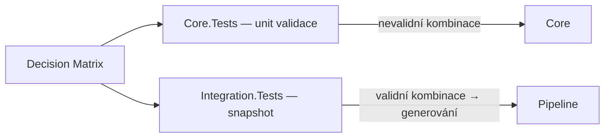

# PROP-032: Integrační testy — Core + Generators (Snapshot-based)

> **Stav:** ✅ Dokončeno
> **Datum:** 2026-07-05
> **Autor:** Copilot (C# Implementer)
> **Návaznost:** PROP-002 (Core), PROP-007 (Generators), PROP-009 (Tests), PROP-031 (Statement System), **PROP-033 (Factory metody + CoreValidator)**
> **Matice:** [`Docs/Integration/01-Integration-Test-Matrix.md`](../Integration/01-Integration-Test-Matrix.md)

---

## Cíl

Vytvořit nový testovací projekt `MetaForge.Core.Integration.Tests` pro integrační testy napříč Core a Generators vrstvami.

Testovat reálné scénáře:
- Sestavit Core elementy (Class, Enum, Struct, Interface, Property, Method)
- Vygenerovat C# kód přes `CodeGenerator`
- Porovnat výstup se **snapshot soubory** (`.expected.cs`) — vzorový kus kódu
- Validovat syntaxi přes `SyntaxValidator.IsValid()` (Roslyn)

Současně doplnit chybějící **unit testy Core validace** pro nevalidní kombinace.

## Princip



3-vrstvá validace v integračních testech:
1. **Snapshot** — porovná celý generovaný kód proti `.expected.cs` → detekce regresí
2. **Syntax** — `SyntaxValidator.IsValid()` → generovaný kód je syntakticky korektní
3. **Content** — FluentAssertions `.Should().Contain(...)` → specifické patterny

---

## Struktura projektu

```
Tests/MetaForge.Core.Integration.Tests/
├── MetaForge.Core.Integration.Tests.csproj
│
├── Snapshots/
│   ├── SnapshotComparer.cs              ← Snapshot engine
│   ├── Class/
│   │   ├── BasicClass.expected.cs
│   │   ├── AbstractClass.expected.cs
│   │   ├── SealedClass.expected.cs
│   │   ├── StaticClass.expected.cs
│   │   ├── PartialClass.expected.cs
│   │   ├── RecordClass.expected.cs
│   │   └── ...
│   ├── Enum/
│   │   ├── BasicEnum.expected.cs
│   │   ├── FlagsEnum.expected.cs
│   │   ├── ByteEnum.expected.cs
│   │   └── ...
│   ├── Struct/
│   ├── Property/
│   ├── Method/
│   └── Constructor/
│
└── Scenarios/
    ├── ClassModifierSnapshots.cs        ← ~8 testů (C1-C8 matice)
    ├── ClassAccessSnapshots.cs          ← ~3 testy (A1,A2,A6)
    ├── EnumVariantsSnapshots.cs         ← ~4 testy (E1-E4)
    ├── StructVariantsSnapshots.cs       ← ~4 testy (S1-S4)
    ├── PropertyModifierSnapshots.cs     ← ~6 testů (P1-P5,P8)
    ├── TypeModelVariantsSnapshots.cs    ← ~19 testů (T1-T18,T22-T23)
    ├── MethodSnapshots.cs               ← ~8 testů (M1-M8) + reálné příklady
    ├── ConstructorSnapshots.cs          ← ~6 testů (K1-K6)
    ├── StatementSnapshots.cs            ← ~10 testů (B1-B10) — AST → render
    │
    ├── AppRootTreeScenario.cs           ← 1 komplexní happy-path
    └── CatalogIntegrationScenario.cs    ← 1 test
```

---

## SnapshotComparer — specifikace

```csharp
/// <summary>
/// Helper pro snapshot testování generovaného kódu.
/// Porovnává vygenerovaný kód s uloženým .expected.cs souborem.
/// </summary>
public static class SnapshotComparer
{
    /// <summary>
    /// Ověří, že generatedCode odpovídá Snapshots/{category}/{testName}.expected.cs.
    /// Pokud soubor neexistuje → vytvoří ho (first-run).
    /// Pokud se liší → fail s diff zprávou.
    /// </summary>
    public static void Verify(string category, string testName, string generatedCode)
    {
        var snapshotDir = Path.Combine(AppContext.BaseDirectory, "..", "..", "..", "Snapshots", category);
        Directory.CreateDirectory(snapshotDir);
        
        var filePath = Path.Combine(snapshotDir, $"{testName}.expected.cs");
        
        if (!File.Exists(filePath))
        {
            File.WriteAllText(filePath, generatedCode);
            Assert.Fail($"Snapshot created: {filePath}. Review and re-run.");
        }
        
        var expected = File.ReadAllText(filePath);
        generatedCode.Should().Be(expected, $"snapshot mismatch for {category}/{testName}");
    }
    
    /// <summary>Validuje syntaxi generovaného kódu.</summary>
    public static void AssertValidSyntax(string generatedCode)
    {
        var isValid = SyntaxValidator.IsValid(generatedCode, out var diagnostics);
        isValid.Should().BeTrue($"syntax error:{Environment.NewLine}{diagnostics}");
    }
}
```

---

## Method snapshots — reálné příklady

Integrační testy metod používají **reálné příklady** místo abstraktních `Foo`.`Bar`:

### S stringovým Body (MVP — před PROP-031)

| Test | Metoda | Modifikátory | Očekávaný výstup |
|------|--------|:------------:|------------------|
| `PythagoreanTheorem` | `static double CalculateHypotenuse(double a, double b)` | static | `return Math.Sqrt(a*a + b*b);` |
| `QuadraticEquation` | `static (double?,double?) Solve(double a, double b, double c)` | static | diskriminant + kořeny |
| `FactorialIterative` | `static int Factorial(int n)` | static | `for` smyčka |
| `CalculateDiscount` | `static decimal CalcDiscount(decimal price, decimal pct)` | static | `return price * pct / 100;` |
| `IsValidEmail` | `static bool IsValidEmail(string email)` | static | regex match |
| `IsAdult` | `static bool IsAdult(DateTime birthDate)` | static | věk z data |
| `GetFullName` | `static string GetFullName(string first, string last)` | static | `$"{first} {last}"` |
| `FetchUsersAsync` | `async Task<List<User>> FetchUsersAsync(string url)` | async | async/await |

### S AST (po PROP-031)

| Test | Statement typy | Popis |
|------|:------------:|-------|
| `PythagoreanAST` | BinaryExpression + ReturnStatement | Sestavit Pythagorovu větu jako AST → render → snapshot |
| `QuadraticAST` | IfStatement + Block + Return | Diskriminant > 0 / = 0 / < 0 větve |
| `FactorialForAST` | ForStatement + Assignment + Return | Iterativní faktoriál přes ForStatement |
| `DiscountIfAST` | IfStatement + Return | `if (pct > 100) pct = 100; return ...` |
| `WhileLoopAST` | WhileStatement + Assignment | `while (n > 1) { result *= n; n--; }` |

---

## Unit testy Core validace (rozšíření existujícího Core.Tests)

Pro každý **❌ řádek** matice → unit test v `Tests/MetaForge.Core.Tests/`.

> **Aktualizace PROP-033:** Testy používají `CoreValidator.Validate()` / `CoreValidator.ValidateMethod()` / `CoreValidator.ValidateProperty()` — ne očekávání výjimek z konstruktorů. Factory metody (PROP-033) znemožňují ❌ kombinace atomicky, takže testy **záměrně vytvářejí elementy přes `new` s nevalidními kombinacemi** a ověřují, že `CoreValidator` je správně detekuje.

```
Tests/MetaForge.Core.Tests/
└── Validation/
    ├── ClassModifierValidationTests.cs    ← ~4 testy (C9,C10,C12) — CoreValidator.Validate()
    ├── ClassAccessValidationTests.cs      ← ~3 testy (A3,A4,A5) — CoreValidator.Validate()
    ├── ClassInheritanceValidationTests.cs ← ~1 test  (I5) — CoreValidator.Validate()
    ├── EnumValidationTests.cs             ← ~2 testy (E5,E6) — CoreValidator.Validate()
    ├── PropertyModifierValidationTests.cs ← ~1 test  (P7) — CoreValidator.ValidateProperty()
    ├── PropertyTypeValidationTests.cs     ← ~3 testy (T19,T20,T21) — CoreValidator.ValidateProperty()
    ├── MethodModifierValidationTests.cs   ← ~4 testy (M9-M12) — CoreValidator.ValidateMethod()
    └── MethodStatementValidationTests.cs  ← ~3 testy (B11-B13) — CoreValidator.ValidateMethod()
```

### Vzor testu (❌ řádek)

```csharp
[Fact]
public void Class_AbstractSealed_ReturnsConflictingModifiersIssue()
{
    // Arrange — záměrně nevalidní kombinace (PROP-033 factory metody by to nedovolily)
    var c = new ClassElement { Name = "Foo", IsAbstract = true, IsSealed = true };

    // Act
    var issues = CoreValidator.Validate(c);

    // Assert
    issues.Should().ContainSingle(i => i.Code == "C9")
        .Which.Category.Should().Be("ConflictingModifiers");
}
```

---

## AppRootTreeScenario — komplexní integrační test

Jeden test, který ověří **celý traversal** od AppRoot po generování:

```csharp
[Fact]
public void AppRoot_WithTwoProjects_GeneratesAllArtifacts()
{
    // Arrange — sestavit strom (používá factory metody z PROP-033)
    var root = new AppRoot();
    
    var coreProject = new ProjectElement { Name = "MyApp.Core", DefaultNamespace = "MyApp.Core" };
    coreProject.RootElements.Add(ClassElement.Basic("Customer"));
    coreProject.RootElements.Add(EnumElement.Basic("CustomerStatus"));
    coreProject.RootElements.Add(InterfaceElement.Basic("IRepository"));
    
    var apiProject = new ProjectElement { Name = "MyApp.Api", DefaultNamespace = "MyApp.Api" };
    apiProject.RootElements.Add(ClassElement.Basic("Startup"));
    
    root.Projects.Add(coreProject);
    root.Projects.Add(apiProject);
    
    // Act — generovat
    var generator = new CodeGenerator();
    var allElements = root.Projects.SelectMany(p => p.RootElements).ToList();
    var artifacts = allElements.Select(e => generator.Generate(e)).ToList();
    
    // Assert
    artifacts.Should().HaveCount(4);
    artifacts.Select(a => a.FileName).Should().Contain(
        "Customer.cs", "CustomerStatus.cs", "IRepository.cs", "Startup.cs");
    artifacts.ForEach(a => SnapshotComparer.AssertValidSyntax(a.SourceCode));
}
```

---

## Dotčené soubory

### Nové
| Soubor | Role |
|--------|------|
| `Docs/Integration/01-Integration-Test-Matrix.md` | Decision matrix — zdroj pravdivosti |
| `Tests/MetaForge.Core.Integration.Tests/MetaForge.Core.Integration.Tests.csproj` | Test projekt |
| `Tests/MetaForge.Core.Integration.Tests/Snapshots/SnapshotComparer.cs` | Snapshot engine |
| `Tests/MetaForge.Core.Integration.Tests/Snapshots/**/*.expected.cs` | Zlaté soubory (~74) |
| `Tests/MetaForge.Core.Integration.Tests/Scenarios/ClassModifierSnapshots.cs` | |
| `Tests/MetaForge.Core.Integration.Tests/Scenarios/ClassAccessSnapshots.cs` | |
| `Tests/MetaForge.Core.Integration.Tests/Scenarios/EnumVariantsSnapshots.cs` | |
| `Tests/MetaForge.Core.Integration.Tests/Scenarios/StructVariantsSnapshots.cs` | |
| `Tests/MetaForge.Core.Integration.Tests/Scenarios/PropertyModifierSnapshots.cs` | |
| `Tests/MetaForge.Core.Integration.Tests/Scenarios/TypeModelVariantsSnapshots.cs` | |
| `Tests/MetaForge.Core.Integration.Tests/Scenarios/MethodSnapshots.cs` | |
| `Tests/MetaForge.Core.Integration.Tests/Scenarios/ConstructorSnapshots.cs` | |
| `Tests/MetaForge.Core.Integration.Tests/Scenarios/StatementSnapshots.cs` | |
| `Tests/MetaForge.Core.Integration.Tests/Scenarios/AppRootTreeScenario.cs` | |
| `Tests/MetaForge.Core.Integration.Tests/Scenarios/CatalogIntegrationScenario.cs` | |
| `Tests/MetaForge.Core.Tests/Elements/Types/ClassModifierValidationTests.cs` | |
| `Tests/MetaForge.Core.Tests/Elements/Types/ClassInheritanceValidationTests.cs` | |
| `Tests/MetaForge.Core.Tests/Elements/Types/EnumValidationTests.cs` | |
| `Tests/MetaForge.Core.Tests/Elements/Members/PropertyModifierValidationTests.cs` | |
| `Tests/MetaForge.Core.Tests/Elements/Members/PropertyTypeValidationTests.cs` | |
| `Tests/MetaForge.Core.Tests/Elements/Members/MethodModifierValidationTests.cs` | |
| `Tests/MetaForge.Core.Tests/Elements/Members/MethodStatementValidationTests.cs` | |

### Upravené
| Soubor | Změna |
|--------|-------|
| `MetaForge.slnx` | Přidat `MetaForge.Core.Integration.Tests` |

---

## Pořadí implementace

| # | Krok | Blokováno | Odhad |
|:-:|------|:---------:|------:|
| 0 | ✅ **PROP-033 — Factory metody + CoreValidator** | — | ✅ Hotovo (2026-07-05) |
| 1 | Vytvořit `MetaForge.Core.Integration.Tests` projekt + csproj + přidat do slnx | 0 | 0,25 dne |
| 2 | Implementovat `SnapshotComparer` | 0 | 0,25 dne |
| 3 | Class + Enum + Struct snapshot testy (používají factory metody) | 0,1,2 | 1 den |
| 4 | Property + TypeModel snapshot testy (používají factory metody) | 0,1,2 | 1,5 dne |
| 5 | Method snapshot testy (string Body — MVP, používají factory metody) | 0,1,2 | 1 den |
| 6 | Constructor snapshot testy | 0,1,2 | 0,5 dne |
| 7 | **Čeká na PROP-031** | | |
| 8 | Statement snapshot testy (AST Body) | 7 | 1 den |
| 9 | Method snapshot testy (AST — reálné příklady) | 7 | 1 den |
| 10 | AppRootTreeScenario + CatalogIntegration | 1 | 0,5 dne |
| 11 | Core validation unit testy (používají CoreValidator) | 0 | 1 den |
| **Celkem** | | | **~7 dní** |

---

## Verifikace

1. `dotnet build Tests/MetaForge.Core.Integration.Tests/` → OK
2. `dotnet test Tests/MetaForge.Core.Integration.Tests/` → všechny testy green
3. První spuštění vytvoří `.expected.cs` soubory (vývojář zkontroluje a committne)
4. Změna Scriban šablony → snapshot test failne → vývojář vidí diff → přegeneruje
5. ✅ **Snapshot testy používají factory metody** (PROP-033) — zaručují validní elementy
6. ❌ **Unit testy používají `CoreValidator.Validate()`** (PROP-033) — testují detekci nevalidních kombinací
7. Nové factory metody v PROP-033 = nové snapshot testy stačí přidat jako další řádek matice

---

## Rozhodnutí

| Aspekt | Volba |
|--------|-------|
| Název projektu | `MetaForge.Core.Integration.Tests` |
| Snapshot engine | Vlastní `SnapshotComparer` |
| Decision matrix | `Docs/Integration/01-Integration-Test-Matrix.md` |
| Validní kombinace (✅) | Snapshot + syntax + content — **používají factory metody z PROP-033** |
| Nevalidní kombinace (❌) | Unit test v existujícím `Core.Tests` — **používají `CoreValidator.Validate()` z PROP-033** |
| Method body reprezentace | `string?` (MVP) → `BlockStatement?` (po PROP-031) |
| Method reálné příklady | Pythagorova věta, kvadratická rovnice, faktoriál, email validace, věk |
| Statement AST varianta | **Varianta B** — typová hierarchie (viz PROP-031) |
| Element konstrukce (✅) | Factory metody (PROP-033) — atomicky validní, žádné `new ClassElement { IsAbstract = true, IsSealed = true }` |
| Element konstrukce (❌) | Přímé `new` + `CoreValidator.Validate()` — testuje detekci nevalidních kombinací |

---

## Legenda

- Status: 📝 Navrženo (revidováno 2026-07-05 — PROP-033)
- Vrstva: Core + Generators (Tests)
- Návaznost: PROP-002, PROP-007, PROP-009, PROP-031, PROP-033
- Priorita: 🟡 Vysoká — integrační testy jsou first-class citizen
