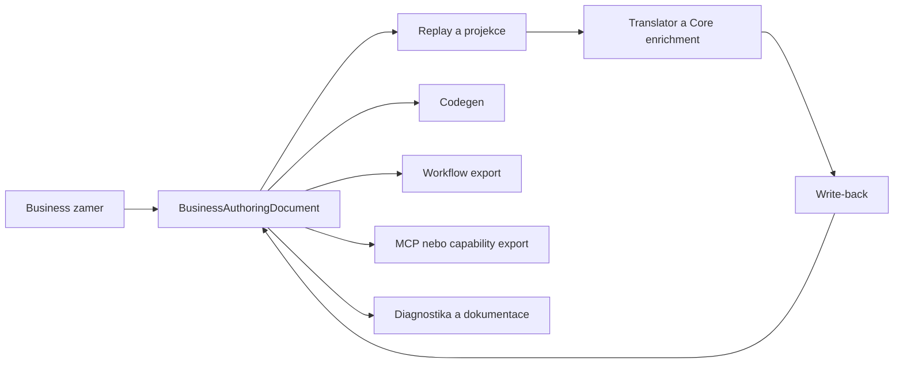
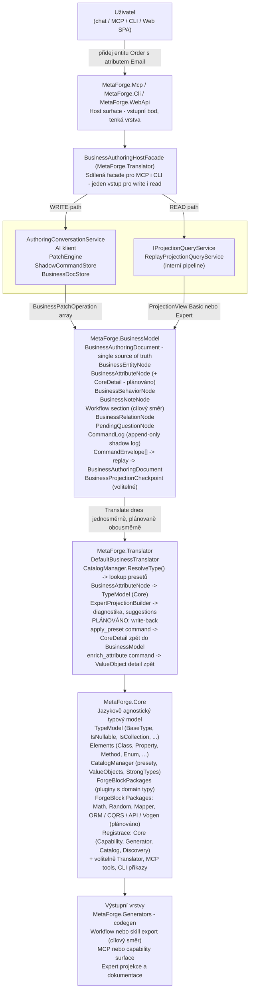

# MetaForge — Platform Overview

Datum: 2026-04-17
Status: Živý dokument — aktualizováno 2026-04-28 (Node Assist + WebApi + Frontend Studio koncept)

---

## Vize platformy

MetaForge je platforma pro **business-first authoring systému**, kde uživatel popisuje svůj systém v přirozených pojmech (entity, atributy, vztahy, chování a postupně i workflow) a platforma automaticky:

1. Přeloží business model na typový Core model
2. Obohacuje atributy o detail (preset, ValueObject, StrongType) z knihovny nebo přes AI
3. Vrací enrichment write-backem zpět do authoring dokumentu
4. Vydává výstup podle cíle: zdrojový kód, workflow artefakt, capability surface, expert projekci nebo dokumentaci

Uživatel pracuje výhradně v **business vrstvě** — nikdy nevidí ani neupravuje Core model přímo.

Podrobné rozpracování tohoto posunu viz `09-Authoring-Kernel-and-Multi-Output-Model.md`.

### Cílové čtení platformy

---

## Základní tok platformy

---

## Klíčové principy

| Princip | Popis |
|---------|-------|
| Business-first | Uživatel pracuje pouze v business vrstvě — nikdy v Core |
| Single source of truth | `BusinessAuthoringDocument` — vždy aktuální stav |
| Append-only CommandLog | Shadow log — replay kdykoliv → deterministický výsledek |
| Authoring kernel | Platforma drží jeden synchronizovaný authoring model a více výstupů nad ním |
| Jazyková agnostičnost Core | Core nesmí obsahovat C#-specific logiku |
| Zero-Fault export | Invalidní model se nesmí exportovat jako vykonatelný artefakt |
| AI jako volitelná vrstva | Graceful fallback na deterministický překlad — vždy |
| Kreditová monetizace | Používání zdarma, generace kódu zpoplatněna kreditovým skóre modelu × jazykový multiplikátor |
| Dvouúrovňová AI (Tier 1 / Tier 2) | Chat AI (Tier 1) je user-facing; interní AI (Tier 2) vracejí pouze strukturovaná data |
| AI konfigurovatelná externě | Provider, model a endpoint definuje hostitelská aplikace — ne platforma |
| Write-back obohacení (plánováno) | Core detail se zapíše zpět do BusinessModel jako command |
| Workflow jako first-class vrstva | Procesní kontext patří do source of truth, ne mimo model |
| ForgeBlock jako registrační jednotka | Každý balíček se sám registruje do Core, Translator, MCP, CLI |
| Discovery jako help kanál | AI klient se dozví dostupné tools a capabilities přes `QueryDiscovery` |
| Node-level assist | Lokální AI asistence nad jedním node — preview návrh, explicit apply |
| Web API pro frontend | REST/JSON thin layer nad Facade — CORS, Swagger, Aspire-ready |
| Frontend Authoring Studio (ve vývoji) | Webový workspace nad Web API — model, workflow, review a assist v jednom authoring prostředí |
| Observability mimo source of truth | Metriky a telemetry export patří do Host a Facade hranic, ne do BusinessModel nebo Core |

---

## Stávající projekty (Src/)

| Projekt | Odpovědnost |
|---------|-------------|
| `MetaForge.BusinessModel` | Business model, CommandLog, Replay, Patches |
| `MetaForge.Translator` | Business → Core překlad, Expert projekce, Facade |
| `MetaForge.Core` | Jazykově agnostický typový model, Catalog, ForgeBlocks |
| `MetaForge.Generators` | Generace kódu pro každý jazyk |
| `MetaForge.Mcp` | MCP server — tools pro AI klienty |
| `MetaForge.Cli` | CLI — příkazová řádka |
| `MetaForge.WebApi` | HTTP REST API pro frontend SPA |
| `MetaForge.Builders` | Fluent buildery pro doménové objekty |
| `MetaForge.Dto` | Transport DTO mezi Translator a Generators |
| `MetaForge.Ai` | AI klienti, konfigurace, zdravotní probe |
| `MetaForge.Chat` | Chat surface (vývoj) |
| `ForgeBlocks/` | Pluginové balíčky s doménovými typy (Math, Random, ...) |

---

## Detailní dokumenty

- [01-Layers.md](01-Layers.md) — detailní popis každé vrstvy, hranice, zodpovědnosti
- [02-Projection-Pipeline.md](02-Projection-Pipeline.md) — projekční vrstva, unified ProjectionView, interní pipeline
- [03-CoreDetail-WriteBack.md](03-CoreDetail-WriteBack.md) — write-back tok, AttributeSyncState, auto/semi-auto
- [04-OpenQuestions.md](04-OpenQuestions.md) — otevřené architektonické otázky
- [05-ForgeBlock-Package-Model.md](05-ForgeBlock-Package-Model.md) — ForgeBlock jako multi-vrstvá registrační jednotka, Discovery/Help pro MCP
- [06-AI-Tiers-and-Providers.md](06-AI-Tiers-and-Providers.md) — dvouúrovňová AI architektura, AiSegment registry, provider abstrakce, enterprise on-premise
- [07-Monetization-Credits.md](07-Monetization-Credits.md) — kreditový systém, výpočet ceny generace, IGenerationCostPolicy, deployment varianty
- [09-Authoring-Kernel-and-Multi-Output-Model.md](09-Authoring-Kernel-and-Multi-Output-Model.md) — nový cílový model authoring kernelu, workflow a více výstupů
- [10-Observability-and-Telemetry.md](10-Observability-and-Telemetry.md) — observability baseline, telemetry boundary, OTLP a Aspire-ready host model
- [11-Frontend-Authoring-Studio.md](11-Frontend-Authoring-Studio.md) — koncept webového authoring studia nad Web API, status ve vývoji
