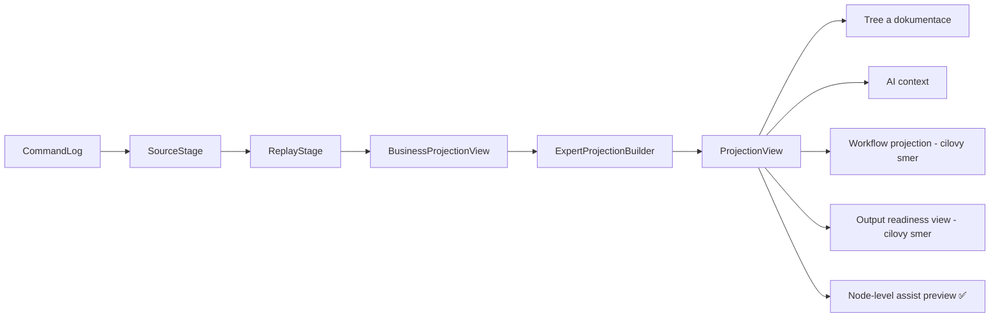

# MetaForge — Projekční vrstva

Datum: 2026-04-27
Status: Implementováno (fáze 0-8 dokončeny), aktualizováno 2026-04-28 (Node Assist)
Zdroj: aktuální implementace v `Src/` + navazující plán v `PROPOSALS.md`

---

## Shrnutí aktuálního stavu

Původní návrh z 2026-04-17 už je z většiny realizovaný:

- Projekce je sjednocena přes `GetProjectionAsync(...)`.
- `IProjectionQueryService` je async a bez závislosti na `ProjectionOptions`.
- V `BusinessModel` běží interní pipeline `SourceStage` + `ReplayStage`, včetně streaming varianty.
- MCP surface je sloučený do jednoho toolu `GetBusinessProjection(detail?)`.
- Source tracking je na `CommandEnvelope.InfoSource`.
- Read/Write split je hotový přes `CommandWriteService`.

Současně je potřeba pipeline nově číst jako **read páteř authoring kernelu**, ne jen jako pomocnou vrstvu pro codegen. Projekce mají být zdrojem business stromu, expert diagnostiky, AI kontextu i budoucích workflow a readiness pohledů.



Původní text dokumentu popisoval cílový návrh; tento dokument nyní popisuje skutečně nasazený stav.

---

## Aktuální architektura

```
MCP / CLI / Chat
└── BusinessAuthoringHostFacade
    └── GetProjectionAsync(options?, streamId?, ct)
        └── ProjectionReadService.GetProjectionAsync(streamId?, options?, ct)   [Translator]
            ├── IProjectionQueryService.GetProjectionAsync(streamId?, ct)        [BusinessModel]
            │   └── interní pipeline:
            │       SourceStage (load/stream + resolve streamId)
            │       ReplayStage (checkpoint + reducer replay)
            │       → BusinessProjectionView
            ├── podmíněně (HasAnyExpertSection):
            │   ExpertProjectionBuilder.Build(document, replay, options)
            ├── podmíněně (Workflow):
            │   WorkflowProjectionBuilder.Build(document, syncStates)
            ├── podmíněně (AuthoringContext || DiscoveryContext):
            │   AuthoringContextBuilder.Build(document, includeDiscovery, discoverySession)
            └── → ProjectionView (Replay + volitelný Expert/Workflow/AuthoringContext)
```

Poznámka: `BusinessAuthoringHostFacade` stále drží helper metody `GetCurrentProjectionJson()`, `GetCurrentProjectionTree()`, `GetCurrentExpertProjectionJson()` a `GetCurrentExpertProjectionTree()` pro host convenience, ale primární sjednocený vstup je `GetProjectionAsync(...)`.

---

## Kontrakty (aktuální)

### ProjectionOptions (Translator)

```csharp
public sealed class ProjectionOptions
{
    public static ProjectionOptions Basic() => new();
    public static ProjectionOptions Expert() => new() { ... };
    public static ProjectionOptions Custom(
        bool diagnostics = false,
        bool typeResolution = false,
        bool suggestions = false,
        bool relationAnalysis = false,
        bool workflow = false,
        bool authoringContext = false,
        bool discoveryContext = false) => new() { ... };

    public bool Diagnostics { get; private init; }
    public bool TypeResolution { get; private init; }
    public bool Suggestions { get; private init; }
    public bool RelationAnalysis { get; private init; }
    public bool Workflow { get; private init; }
    public bool AuthoringContext { get; private init; }
    public bool DiscoveryContext { get; private init; }

    public bool HasAnyExpertSection =>
        Diagnostics || TypeResolution || Suggestions || RelationAnalysis;

    public bool HasAnyWorkflowOrContextSection =>
        Workflow || AuthoringContext || DiscoveryContext;
}
```

### ProjectionView (Translator)

```csharp
public sealed class ProjectionView
{
    public BusinessProjectionView Replay { get; init; } = new();
    public ExpertProjectionView? Expert { get; init; }
    public WorkflowProjectionView? Workflow { get; init; }
    public AuthoringContextView? AuthoringContext { get; init; }
}
```

Další plánovaný směr:

- `WorkflowProjectionView` jako projekce workflow sekce dokumentu,
- `AuthoringContextView` jako kompaktní vstup pro AI segmenty,
- `OutputReadinessView` jako pohled na stav `Draft`, `Enriched`, `ExportReady` per výstup.

### IProjectionQueryService (BusinessModel)

```csharp
public interface IProjectionQueryService
{
    Task<BusinessProjectionView> GetProjectionAsync(
        string? streamId = null,
        CancellationToken cancellationToken = default);
}
```

### ProjectionReadService (Translator)

```csharp
public sealed class ProjectionReadService
{
    public Task<ProjectionView> GetProjectionAsync(
        string? streamId = null,
        ProjectionOptions? options = null,
        CancellationToken cancellationToken = default);
}
```

---

## BusinessModel interní pipeline (aktuální)

`ReplayProjectionQueryService` orchestrace:

1. Rozhodnutí o režimu přes `SourceStage.ShouldUseStreaming(...)`.
2. Non-streaming větev:
   - `SourceStage.Load(...)` načte a odfiltruje commandy,
   - `ReplayStage.Execute(...)` aplikuje checkpoint + replay.
3. Streaming větev:
   - `SourceStage.ResolveStreamIdAsync(...)` rychle zjistí stream,
   - `SourceStage.StreamAsync(...)` streamuje JSONL,
   - `ReplayStage.ExecuteStreamingAsync(...)` aplikuje dávky bez načtení celého logu do paměti.

Výstup je vždy mapován na `BusinessProjectionView` včetně metadata (`TotalCommandCount`, `ReplayedCommandCount`, `CheckpointCommandCount`, `UsedCheckpoint`, `CommandLogPath`, `CheckpointPath`).

---

## MCP surface (aktuální)

Duplicita `GetBusinessProjection` vs `GetBusinessExpertProjection` je odstraněna.

Aktivní je jedna metoda:

```csharp
GetBusinessProjection(string? detail = null)
```

Parsování `detail`:

- `null` nebo `basic` -> `ProjectionOptions.Basic()`
- `expert` -> `ProjectionOptions.Expert()`
- kombinace `diagnostics,suggestions,type_resolution,relation_analysis` -> `ProjectionOptions.Custom(...)`

Tool vrací:

- vždy replay část (`ReadDocumentJson`, `WriteDocumentJson`, `ProjectionDocumentJson`, počty, tree),
- expert sekce nullable (`ExpertProjectionJson`, diagnostické county) podle zvolených options.

---

## Read/Write split (aktuální)

Split je implementovaný:

- `CommandWriteService` drží write path (patch engine, shadow log, persistence, startup sync).
- `AuthoringConversationService` je tenčí orchestrátor nad write službou a AI vrstvami.
- Startup lifecycle je explicitně komentovaný: `SyncCurrentDocumentFromProjection()` je startup-only, ne po každé mutaci.

V novém směru je read path ještě důležitější: write cesta mění source of truth, ale read cesta skládá kompaktní a auditovatelný kontext pro AI, dokumentaci, workflow a budoucí exportní profily.

### Node-level assist jako read consumer pipeline

Lokální asistence nad jedním node je další legitimní konzument této read páteře.

- Host nesmí číst `BusinessAuthoringDocument` bokem a sám stavět AI kontext.
- `AssistNode` nebo obdobný use-case musí nejdřív získat `ProjectionView` přes `GetProjectionAsync(...)`.
- Node-scoped context se skládá až z projekce, ne z paralelního direct-read helperu.
- Preview návrh se po potvrzení vrací do stejné write cesty přes `ApplyOperations`.

To zajišťuje, že lokální AI asistence respektuje fallback bez shadow logu, read/write split i auditovatelnost command logu.

---

## Další plánovaný rozvoj pipeline

| Oblast | Směr |
|--------|------|
| Workflow | přidat workflow projection view nad synchronizovanou workflow sekcí |
| AI context | sestavovat strukturovaný authoring context z replay, expert view, pending questions a discovery |
| Node assist | ✅ Implementováno — `NodeAssistContextBuilder` skládá node-scoped kontext z `ProjectionView` pro `AssistNodeAsync` |
| Readiness | počítat stav připravenosti pro různé výstupy nad týmž dokumentem |
| Output neutrality | držet projekce nezávislé na tom, zda cílí do kódu, workflow nebo capability surface |

---

## Source tracking (aktuální)

`CommandEnvelope` obsahuje pole:

```csharp
public CoreInfoSource InfoSource { get; init; } = CoreInfoSource.Manual;
```

- Enum: `Generated`, `Manual`, `Hybrid`.
- Výchozí `Manual` drží zpětnou kompatibilitu pro starší JSONL bez pole `infoSource`.

---

## Stav fází (rekapitulace)

| Fáze | Stav |
|------|------|
| 0 | Hotovo |
| 1 | Hotovo |
| 2 | Hotovo |
| 3 | Hotovo |
| 4 | Hotovo |
| 5 | Hotovo (sjednocený MCP tool) |
| 6 | Hotovo (interní streaming) |
| 7 | Hotovo (`InfoSource`) |
| 8 | Hotovo (`CommandWriteService`) |

Otevřený navazující bod mimo tento dokument: aktualizace systémového promptu AI klientů, aby při potřebě diagnostiky/type resolution volali `GetBusinessProjection(detail: "expert")` nebo cílenou kombinaci sekcí.

---

## Kde to žije dnes (source of truth)

| Co | Soubor |
|----|--------|
| Host facade | `Src/MetaForge.Translator/Host/BusinessAuthoringHostFacade.cs` |
| Read orchestrator | `Src/MetaForge.Translator/Host/ProjectionReadService.cs` |
| Projection options | `Src/MetaForge.Translator/Host/ProjectionOptions.cs` |
| Unified view | `Src/MetaForge.Translator/Host/ProjectionView.cs` |
| Query kontrakt | `Src/MetaForge.BusinessModel/CommandLog/IProjectionQueryService.cs` |
| Replay orchestrator | `Src/MetaForge.BusinessModel/CommandLog/ReplayProjectionQueryService.cs` |
| Source stage | `Src/MetaForge.BusinessModel/CommandLog/SourceStage.cs` |
| Replay stage | `Src/MetaForge.BusinessModel/CommandLog/ReplayStage.cs` |
| Source tracking envelope | `Src/MetaForge.BusinessModel/CommandLog/CommandEnvelope.cs` |
| MCP tool surface | `Src/MetaForge.Mcp/Tools/BusinessModelTools.cs` |
| Write split služba | `Src/MetaForge.Translator/Conversation/CommandWriteService.cs` |

---

## Poznámka k údržbě

Při dalších změnách držet pravidlo: pokud se liší kód a tento dokument, prioritu má implementace v `Src/` a dokument je potřeba aktualizovat ve stejném PR.
