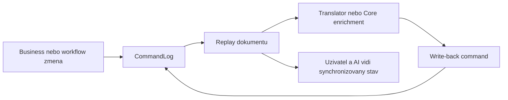
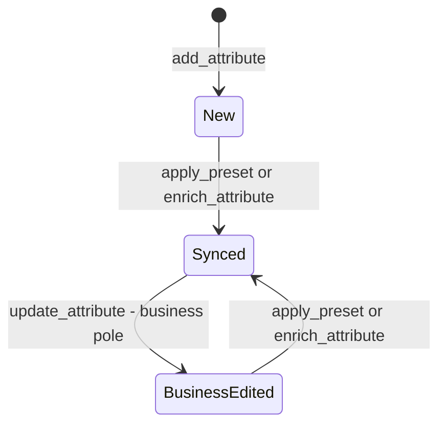

# MetaForge — CoreDetail Write-Back a AttributeSyncState

Datum: 2026-04-17
Status: Částečně implementováno (Plán 1 + 2 hotov, viz Progress.md)
Zdroj: Analytická diskuze 2026-04-16/17

> **Pozn. k implementaci:** Plán 1 (Fáze 0–6) implementoval základní write-back: `BusinessAttributeCoreDetail`, `AttributeSyncState`, patch operace `apply_preset`, `enrich_attribute`, `update_coredetail`, enrichment konfiguraci a tree renderer. Plán 2 přidal auto-apply presety, `UpdateCoreDetail` MCP tool a `ApplyEnrichment` MCP tool. HybridTranslator wiring odložen. Tento dokument nově rozšiřuje write-back jako **obecný synchronizační vzor** i pro workflow a další authoring sekce.

---

## Vize

Uživatel zadá v chatu/MCP svůj požadavek v přirozených pojmech:

```
"přidej entitě Order atribut Email"
```

Platforma automaticky:
1. Vyhledá `Email` v katalogu presetů
2. Najde `email-vo` preset (EmailAddress ValueObject)
3. Zapíše CoreDetail zpět do `BusinessAttributeNode` jako command
4. Uživatel vidí v Business Tree obohacený atribut

```
Entity: Order
  └── email: EmailAddress (VO) [SYNCED]
              ↑ CoreDetail doplněn z preset email-vo
```

Tento princip už nemá být omezen jen na atributy. Stejný vzor se má použít i pro workflow bindingy, capability mapping a export readiness metadata.

---

## Write-back jako obecný pattern authoring kernelu



### Co to znamená prakticky

- business vrstva je vstupní i návratová vrstva,
- enrichment se nesmí ztratit v nižší vrstvě,
- AI dostává kompaktní a synchronizovaný kontext,
- různé výstupy pracují nad stejným authoring dokumentem.

---

## Současný stav (co chybí)

Dnes tok probíhá **jednosměrně**:

```
Business (AttributeNode.Type = "email")
    ↓  DefaultBusinessTranslator
Core (TypeModel — EmailAddress VO)
    ↓  Generator
Kód (.cs, .ts, ...)
```

`ExpertProjectionBuilder` dnes pouze **navrhuje** (`SuggestedPresetId`) — ale výsledek nikdy **nezapíše zpět** do `BusinessAttributeNode`. Atribut zůstane vždy bez CoreDetail.

**Chybějící kus:** obousměrný tok s write-back:

```
Business (AttributeNode)
    ↓  preset lookup / AI translate
Core (TypeModel + ValueObject detail)
    ↓  WRITE-BACK ← toto chybí
Business (AttributeNode s doplněným CoreDetail)
    ↓
Business Tree — uživatel vidí obohacený atribut
```

Další chybějící kus v novém směru:

```text
Workflow (kroky a vazby)
  -> translator nebo capability binding
  -> write-back workflow detailu
  -> synchronizovaný workflow pohled v dokumentu
```

---

## Nový datový model

### BusinessAttributeNode — rozšíření

```csharp
public sealed class BusinessAttributeNode
{
    // Stávající business pole
    public string Id { get; init; } = string.Empty;
    public string Name { get; init; } = string.Empty;
    public string Type { get; init; } = "text";
    public string? CustomType { get; init; }
    public bool Required { get; init; }
    public string? Summary { get; init; }
    public string? DefaultValue { get; init; }
    public IReadOnlyList<string> Constraints { get; init; } = [];
    public string? Computed { get; init; }
    public string? PresetId { get; init; }

    // NOVÉ — write-back sekce z Core vrstvy
    public BusinessAttributeCoreDetail? CoreDetail { get; init; }
}

public sealed class BusinessAttributeCoreDetail
{
    public AttributeSyncState SyncState { get; init; }  // computed při replay, neuloženo
    public CoreInfoSource Source { get; init; }          // kdo naposledy zapsal CoreDetail
    public string? ResolvedPresetId { get; init; }
    public string? ValueObjectName { get; init; }
    public bool IsStrongType { get; init; }
    public DateTimeOffset? LastSyncedAt { get; init; }
}
```

  ### Další krok — workflow analogie

  Pracovní směr pro workflow:

  ```csharp
  public sealed class WorkflowStepCoreDetail
  {
    public string? CapabilityId { get; init; }
    public string? ToolHandle { get; init; }
    public string? BindingKind { get; init; }
    public DateTimeOffset? LastSyncedAt { get; init; }
  }
  ```

  Tento typ zde není zaveden jako finální kontrakt, ale jako směr: workflow sekce má mít stejnou možnost write-back enrichmentu jako atributy.

---

## AttributeSyncState — stavový automat

`SyncState` se **počítá v `BusinessProjectionReducer` při replay** — není uložen jako data v command logu. Je to odvozený stav z historie commandů pro každý atribut.

Aktuální implementace (dle OQ-006) používá zjednodušený 3-stavový model bez `CoreEdited` a `Conflict`:

### Stavy

```csharp
public enum AttributeSyncState
{
    New,              // Přidán, žádný CoreDetail
    Synced,           // CoreDetail přítomen a v souladu s business poli
    BusinessEdited,   // Business pole změněno po posledním sync → navrhni re-obohacení
}
```

### Přechodový diagram



### Tabulka přechodů

| Z | Operace | Do |
|---|---------|-----|
| *(neexistuje)* | `add_attribute` | `New` |
| `New` | `apply_preset` / `enrich_attribute` | `Synced` |
| `Synced` | `update_attribute` (business pole) | `BusinessEdited` |
| `BusinessEdited` | `apply_preset` / `enrich_attribute` | `Synced` |

---

## Nové BusinessPatchOperation typy

```csharp
// Zapsat výsledek preset lookup — CoreDetail z katalogu
{ Op = "apply_preset", EntityId = "...", AttributeId = "...", Data = { "presetId": "email-vo" } }

// Zapsat výsledek AI/deterministického překladu — CoreDetail z Translatoru
{ Op = "enrich_attribute", EntityId = "...", AttributeId = "...", Data = { "valueObjectName": "EmailAddress", "isStrongType": true, ... } }

// Ručně upravit Core detail — uživatel mění parametry ValueObjectu
{ Op = "update_core_detail", EntityId = "...", AttributeId = "...", Data = { "isNullable": true } }
```

---

## Auto vs. Semi-automatický write-back

### Přepínač v konfiguraci

```csharp
public sealed class EnrichmentConfiguration
{
    // Automatický write-back — emit command ihned po AddAttribute
    public bool AutoApplyPresets { get; init; } = false;

    // Semi-automatický — ExpertProjection navrhne, uživatel potvrdí
    public bool SuggestEnrichments { get; init; } = true;
}
```

Součást `AuthoringConversationConfiguration` — analogicky k existujícím přepínačům `Persistence.Enabled`, `ShadowLog.Enabled`.

### Tok pro každý režim

**Auto (`AutoApplyPresets = true`):**

```
AddAttribute("Email")
  → CatalogManager.Lookup("Email")
  → hit: emit { op: "apply_preset", presetId: "email-vo" }
  → SyncState: Synced
  → Business Tree: email: EmailAddress (VO) [SYNCED]
```

**Semi-auto (`AutoApplyPresets = false`):**

```
AddAttribute("Email")
  → CatalogManager.Lookup("Email")
  → hit: ExpertProjection.SuggestedPresetId = "email-vo"
  → SyncState: New
  → Business Tree: email: text [NEW] 💡 Navrhován preset: EmailAddress (VO)
  
  Uživatel potvrdí: ApplyEnrichment("attr-id", "email-vo")
  → emit { op: "apply_preset", presetId: "email-vo" }
  → SyncState: Synced
```

### Pravidlo: auto-apply respektuje SyncState

```
AutoApplyPresets = true  + SyncState: New           → auto-emit (bezpečné)
AutoApplyPresets = true  + SyncState: BusinessEdited → auto-emit (bezpečné)
AutoApplyPresets = true  + SyncState: CoreEdited     → NE — uživatel upravil ručně
AutoApplyPresets = true  + SyncState: Conflict       → NE — vyžaduje explicitní rozhodnutí
```

**Kritické:** Auto-apply bez Source tracking je nebezpečné — systém bez `SyncState` nemůže vědět, zda smí přepsat existující CoreDetail. **Source tracking je prerekvizita auto-apply.**

---

## Jak uživatel uvidí stavy v Business Tree

```
Entity: Order
  ├── [NEW]              customerId: Guid
  ├── [SYNCED]           email: EmailAddress (VO)        ← CoreDetail z preset email-vo
  ├── [BUSINESS EDITED]  phone: PhoneNumber (VO)         ← název změněn na "phone2", re-obohacení navrženo
  ├── [CORE EDITED]      amount: MoneyAmount (VO)        ← IsNullable ručně změněno
  └── [CONFLICT]         status: OrderStatus             ← business i Core změněno od sync
```

Analogický princip se má rozšířit i pro workflow view, například:

```text
Workflow: OrderApproval
  ├── [DRAFT]      ValidateInput
  ├── [BOUND]      ReserveStock -> capability inventory.reserve
  ├── [BOUND]      RequestApproval -> human.approval
  └── [PENDING]    NotifyCustomer -> ceka na binding
```

---

## Hranice authoring dokumentu

Do `BusinessAuthoringDocument` patří:

- definice business a workflow struktury,
- write-back detail,
- pending questions,
- computed sync a readiness pohled.

Do `BusinessAuthoringDocument` naopak nepatří:

- historie konkrétních běhů workflow runtime,
- execution telemetry,
- provozní log jednotlivých instancí procesu.

To patří do samostatné runtime nebo execution vrstvy, ne do authoring source of truth.

---

## Fáze implementace

| Fáze | Obsah | Prerekvizita |
|------|-------|--------------|
| 7a | `BusinessAttributeNode.CoreDetail` — datový model | Fáze 0-6 (projekce) |
| 7b | `AttributeSyncState` enum + výpočet v `BusinessProjectionReducer` | 7a |
| 7c | Nové operace: `apply_preset`, `enrich_attribute`, `update_core_detail` | 7a |
| 7d | `EnrichmentConfiguration` + přepínač v `AuthoringConversationConfiguration` | 7c |
| 7e | Semi-auto: `ApplyEnrichment(attributeId, presetId)` na Facade + MCP tool | 7c, 7d |
| 7f | Auto: při `AddAttribute` → `CatalogManager.Lookup` → podmíněný emit | 7e — Source tracking |
| 7g | Business Tree renderer — zobrazení `SyncState` jako prefix | 7b |

---

## Existující kód — kde to žije dnes

> Při implementaci začni od těchto souborů — nepřepisuj, ale rozšiř a přesuň.

| Co | Soubor | Poznámka |
|----|--------|----------|
| `BusinessAuthoringDocument` | `Src/MetaForge.BusinessModel/` — hledej `BusinessAuthoringDocument.cs` | Hlavní dokument — sem přibyde `BusinessAttributeNode.CoreDetail` |
| `BusinessProjectionReducer` | `Src/MetaForge.BusinessModel/CommandLog/BusinessProjectionReducer.cs` | Sem přibyde výpočet `AttributeSyncState` při replay |
| `CatalogManager` | `Src/MetaForge.Core/Catalog/CatalogManager.cs` | `ResolveType()`, `SuggestPreset()` — základ pro auto-apply lookup |
| `BuiltInCatalogProvider` | `Src/MetaForge.Core/Catalog/BuiltInCatalogProvider.cs` | Embedded presety — odtud bere CatalogManager Core presety |
| `FileSystemCatalogProvider` | `Src/MetaForge.Core/Catalog/FileSystemCatalogProvider.cs` | `~/.metaforge/presets/` — uživatelské presety, dnes orientované na Core typy |
| `BusinessAuthoringHostFacade` | `Src/MetaForge.Translator/Host/BusinessAuthoringHostFacade.cs` | `ApplyEnrichment(attributeId, presetId)` přibyde sem (Fáze 7e) |
