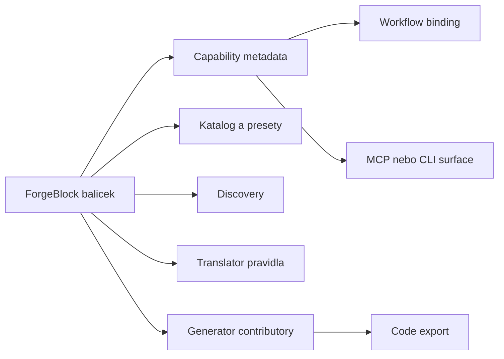

# MetaForge — ForgeBlock Package Model

Datum: 2026-04-17
Status: Živý dokument — aktualizováno 2026-04-28 (WebApi host surface)

---

## Vize

Každý ForgeBlock balíček je **samostatná registrační jednotka** — ví kam patří a sám se zaregistruje do všech vrstev, které potřebuje. Hostitelská aplikace (MCP server, CLI, WebApi) projde seznam balíčků a nechá každý balíček se zaregistrovat do příslušných registrů.

```
OrmForgeBlockPackage.Register(coreRegistry)
OrmForgeBlockPackage.RegisterMcp(mcpRegistry)     // přidá vlastní MCP tools
OrmForgeBlockPackage.RegisterCli(cliRegistry)     // přidá vlastní CLI příkazy
OrmForgeBlockPackage.RegisterWebApi(webApiRegistry) // přidá vlastní HTTP endpointy
```

Platforma se tím stane **pluginová** — nové doménové schopnosti (ORM, CQRS, API, Vogen...) přibývají instalací balíčku, ne úpravou platformního jádra.

V novém cílovém směru je navíc potřeba číst ForgeBlock méně jako „plugin pro codegen“ a více jako **capability balíček pro authoring kernel**.



---

## Aktuální stav — 4 contribution facety

Každý balíček implementuje `IForgeBlockPackage` a registruje své contributory do `IForgeBlockRegistry` (Core):

```csharp
public interface IForgeBlockRegistry
{
    void AddCapabilityProvider(IForgeBlockCapabilityProvider provider);   // co balíček umí
    void AddGeneratorContributor(IForgeBlockGeneratorContributor contributor); // šablony + codegen
    void AddCatalogContributor(IForgeBlockCatalogContributor contributor); // presety, katalog
    void AddDiscoveryContributor(IForgeBlockDiscoveryContributor contributor); // help, handles
    void RegisterCapability(CapabilityMetadata metadata);                 // tool-level operace s parametry a návratem
}
```

### 5. facet — CapabilityMetadata (Plán 3)

Od Plánu 3 (ForgeBlock Contracts I) existuje **5. registrační facet**: `RegisterCapability(CapabilityMetadata)`. Na rozdíl od `ForgeBlockCapabilityDescriptor` (family-level popis) nese `CapabilityMetadata` **tool-level detail** — parametry (`ParameterMetadata`), návratový typ (`ReturnMetadata`) a neutrální pojmy bez MCP/CLI specifik.

Host bootstrap pak mapuje tyto neutrální metadata na host-specifický schema:
- **MCP**: `ForgeBlockMcpBootstrap.MapCapabilities()` → `McpToolDefinition`
- **CLI**: `ForgeBlockCliBootstrap.MapCapabilities()` → `CliCommandDefinition`
- **WebApi**: `ForgeBlockWebApiBootstrap.MapCapabilities()` → `EndpointRouteBuilder`

Balíček, který chce registrovat tool-level capabilities, implementuje `IForgeBlockCapabilityPackage`.

### Příklad — Math package

```csharp
public sealed class MathForgeBlockPackage : IForgeBlockPackage
{
    public void Register(IForgeBlockRegistry registry)
    {
        registry.AddCapabilityProvider(new MathForgeBlockCapabilityProvider());
        registry.AddGeneratorContributor(new MathForgeBlockGeneratorContributor());
        registry.AddCatalogContributor(new MathForgeBlockCatalogContributor());
        registry.AddDiscoveryContributor(new MathForgeBlockDiscoveryContributor());
    }
}
```

### Existující built-in balíčky

| Balíček | Capability | Discovery kategorie |
|---------|-----------|---------------------|
| `Math` | `standard-math` | `math` — sqrt, abs, pow, log, trig... |
| `Random` | `random-values` | `random` — value |
| `Mapper` | `model-mapping` | `mapper` — map, mapcollection, reverse, alias |

---

## Co nese každý contribution facet

### `IForgeBlockCapabilityProvider`
- Deklarace capability: ID, displayName, popis, tagy, sémantické handles
- Použití: ExpertProjectionBuilder pro type resolution a suggestions
- Další směr: capability metadata jako vstup pro workflow binding a host export

### `IForgeBlockGeneratorContributor`
- Šablony (Scriban nebo jiné) pro každý cílový jazyk
- Mapování `ForgeBlockCapabilityDescriptor` na generovaný kód
- Wrapper importy, package references

Poznámka: generator contributor zůstává důležitý, ale je jen jednou z rolí ForgeBlocku.

### `IForgeBlockCatalogContributor`
- Katalogové záznamy (`ForgeBlockCatalogEntryDescriptor`) s volitelným `CatalogItemType`
- Presety — záznamy s `CatalogItemType` vstupují do `CatalogManager` a jsou dostupné jako `presetId`
- Reference záznamy (bez `CatalogItemType`) — discovery-only, do CatalogManager nevstupují

Další směr: katalog balíčku může sloužit nejen pro type resolution, ale i pro business šablony a workflow binding hints.

### `IForgeBlockDiscoveryContributor`
- `ForgeBlockDiscoveryItem` záznamy s ID, displayName, description, SemanticHandles, UsageExample
- Surfované přes `QueryDiscovery("capabilities")` v MCP, CLI i Chat
- Federovaný model — každý balíček nese svá discovery metadata sám

V novém směru je discovery klíčové i pro AI klienta, který potřebuje vědět nejen co capability znamená, ale i kdy ji použít v authoring nebo workflow kontextu.

---

## Rozšířené čtení ForgeBlocku

| Role ForgeBlocku | Dnes | Cílový směr |
|------------------|------|-------------|
| Codegen | hotovo | zůstává důležité |
| Type a preset lookup | hotovo | rozšířit o business a workflow hints |
| Discovery | hotovo | zásadní vstup pro AI a agent surface |
| Workflow binding | částečně implicitní | explicitní capability mapping do workflow kroků |
| Host export | plánováno | capability metadata mapovat do MCP, CLI a dalších hostů |
| AI adapter | plánováno | volitelné doménové rozšíření nad stejnou capability vrstvou |

---

## Plánované rozšíření — multi-vrstvá registrace

### Problém
`IForgeBlockRegistry` žije v `MetaForge.Core`. Core nesmí záviset na MCP nebo CLI (circular dependency). Jedno `Register(IForgeBlockRegistry)` volání proto nemůže přidat MCP tools — Core nezná `[McpServerTool]`.

### Řešení — optional interfaces per host vrstva

Balíček implementuje více interface, každý pro jinou vrstvu. Každý hostitelský projekt si při startu projde registrované balíčky a sebere si co potřebuje přes pattern matching:

```csharp
// Core registry (vždy)
public interface IForgeBlockPackage
{
    ForgeBlockPackageDescriptor Descriptor { get; }
    void Register(IForgeBlockRegistry registry);
}

// MCP rozšíření (volitelné) — žije v MetaForge.Mcp nebo sdíleném kontraktu
public interface IForgeBlockMcpPackage
{
    void RegisterMcp(IForgeBlockMcpRegistry registry);
}

// CLI rozšíření (volitelné) — žije v MetaForge.Cli nebo sdíleném kontraktu
public interface IForgeBlockCliPackage
{
    void RegisterCli(IForgeBlockCliRegistry registry);
}

// Translator rozšíření (volitelné) — kus překladače
public interface IForgeBlockTranslatorPackage
{
    void RegisterTranslator(IForgeBlockTranslatorRegistry registry);
}

// AI adapter rozšíření (volitelné) — LoRA adaptery pro Tier 2 modely
public interface IForgeBlockAiAdapterPackage
{
    void RegisterAiAdapters(IForgeBlockAiAdapterRegistry registry);
}
```

### Registrace při startu hostitelské aplikace

```csharp
// MCP Program.cs
var packages = BuiltInForgeBlockPackageBootstrap.CreatePackages();

foreach (var package in packages)
{
    // Core facety — vždy
    package.Register(coreRegistry);

    // MCP facety — jen pokud balíček implementuje interface
    if (package is IForgeBlockMcpPackage mcp)
        mcp.RegisterMcp(mcpRegistry);
}

// CLI Program.cs
foreach (var package in packages)
{
    package.Register(coreRegistry);

    if (package is IForgeBlockCliPackage cli)
        cli.RegisterCli(cliRegistry);
}
```

### Co může balíček registrovat do MCP

```csharp
// IForgeBlockMcpRegistry
public interface IForgeBlockMcpRegistry
{
    // Help items surfované přes QueryDiscovery("tools")
    void AddToolHelp(ForgeBlockToolHelpItem item);

    // Budoucí: přidat vlastní MCP tool handlery
    // void AddTool(string name, Func<ToolArguments, ToolResult> handler);
}
```

### Co může balíček registrovat do Translátoru

```csharp
// IForgeBlockTranslatorRegistry
public interface IForgeBlockTranslatorRegistry
{
    // Část překladače pro tuto doménu
    void AddTranslationRule(IForgeBlockTranslationRule rule);

    // Preset resolver — jak mapovat business typ na katalogový preset
    void AddPresetResolver(IForgeBlockPresetResolver resolver);
}
```

---

## Discovery — Help pro MCP AI klienty

Dnes `QueryDiscovery("tools")` vrátí prázdno. AI klient připojený přes MCP se nemůže dozvědět, jaké tools má k dispozici a jak je použít.

### Plánované řešení

Přidat kategorii `tools` do `DefaultDiscoverySession`, naplněnou přes `IForgeBlockMcpRegistry.AddToolHelp()`:

```
QueryDiscovery("tools")
└── read
│   ├── GetDiscoveryHelp — zobraz dostupné kategorie
│   ├── QueryDiscovery — drill-down do kategorií a položek
│   ├── GetBusinessTree — aktuální Business Tree (detail: Basic|Extended|Full)
│   └── GetBusinessProjection — replay projekce (detail: Basic → strom; Expert → + diagnostika, type resolution)
├── mutate
│   ├── AddEntity — přidej entitu
│   ├── AddAttribute — přidej atribut (type, presetId, constraints, computed...)
│   └── ...
├── export
│   └── ExportCode — generuj kód (language: CSharp|TypeScript|Python|Java|Go)
└── session
    ├── CreateBusinessProject — nový projekt
    └── SetBusinessTreeDetail — nastav výchozí detail pro tuto session
```

V authoring-kernel směru se discovery nepoužívá jen pro help. Je to i zdroj kontextu pro AI, workflow binding a capability-oriented exporty.

---

## Jak se ForgeBlock Math balíček zapojuje do překladové a renderovací vrstvy

Tato sekce dokumentuje pozorované chování pro `MathForgeBlockPackage` — vzor platí pro každý balíček standardní knihovny.

### Tři vrstvy zapojení

```
Balíček registrován
        │
        ├─► Core vrstva (IForgeBlockRegistry)
        │       MathForgeBlockCapabilityProvider → capability "standard-math"
        │       MathForgeBlockDiscoveryContributor → QueryDiscovery("capabilities") vrátí math
        │
        ├─► Renderovací vrstva (MathSemanticRenderer + StandardLibraryTranslatorRegistry)
        │       MathForgeBlockPackage zavolá BuiltInStandardLibraryBootstrap.RegisterBuiltIns()
        │       → MathStandardLibraryTranslator zaregistrován pro klíč "math"
        │       → RenderCode(language) přeloží math výrazy do cílového jazyka
        │
        ├─► Překladová vrstva (plánováno — IForgeBlockTranslatorPackage)
        │       TranslationRule + PresetResolver pro Business → Core překlad math atributů
        │
        └─► AI adapter vrstva (plánováno — IForgeBlockAiAdapterPackage)
                LoRA adaptery pro Tier 2 base modely — naučí model kanonické mf.math.* notaci
                Dataset poskytuje vydavatel balíčku, LoRA adapter je součástí NuGet balíčku
                Balíček je verzovaný → adapter a API jsou vždy konzistentní
```

### Renderovací vrstva — jak funguje překlad math výrazů

`MathSemanticRenderer` zachytí math volání v `ComputedExpression.RawCode` přes broad regex:

```
(?<![\w.])(?:mf\.math|math|Math|System\.Math)\.
```

Regex zachytí **všechny formy** — jak kanonické (`mf.math.sqrt`) tak C#-specifické (`Math.Sqrt`).
Po zachycení předá `MathStandardLibraryTranslator` který má per-language mappings:

| Jazyk | Výsledek pro `sqrt` |
|-------|---------------------|
| C# | `Math.Sqrt` |
| TypeScript | `Math.sqrt` |
| Python | `math.sqrt` |
| Java | `Math.sqrt` |
| Go | `math.Sqrt` |

### Proč AI (Tier 2) nemusí znát kanonický tvar

`AiConstraintInferencer.SystemPromptHeader` instruuje AI generovat **C# výrazy**:
`"Condition musí být validní C# výraz"`, `"Variable type musí být C# typ: int, double, string"`.

AI proto napíše `Math.Sqrt(D)` — C# specifický tvar. Při renderování pro Python/Go/TypeScript
ho `MathSemanticRenderer` normalizuje přes broad regex. AI nemusí vědět nic o `mf.math.*`.

### Kritická podmínka: bootstrap musí proběhnout

Pokud `MathForgeBlockPackage` **není zaregistrován**:

| Situace | Výsledek |
|---------|----------|
| Kanonický tvar `mf.math.sqrt(D)` | `InvalidOperationException` — translator nenalezen |
| C# tvar `Math.Sqrt(D)` pro neC# jazyk | Renderer ho **tiše propustí** jako raw string — kód je broken |

**Bootstrap v testech:** `BuiltInStandardLibraryBootstrap.RegisterBuiltIns()` musí být
voláno ve static constructoru testů nebo při startu hostitele.  
**Bootstrap v produkci:** Host (MCP/CLI) při startu projde `BuiltInForgeBlockPackageBootstrap.CreatePackages()`
a zaregistruje každý balíček — tím StandardLibraryTranslatorRegistry správně naplní.

### Gap: AI nedostává seznam dostupných capabilities

`BuildPromptForMethod()` v `AiConstraintInferencer` dnes **nevkládá** do promptu seznam
dostupných ForgeBlock capabilities. AI proto nemůže vědět, že má použít `mf.math.sqrt(D)` místo
`Math.Sqrt(D)`. Funguje to díky broad regex normalizaci, ale pro kanonický tvar a budoucí ForgeBlocks
(kde neexistuje fallback normalizace) bude prompt injection potřebná.

---

## Dependency pravidla

| Pravidlo | Důvod |
|----------|-------|
| `IForgeBlockPackage` a `IForgeBlockRegistry` patří do `MetaForge.Core` | Jsou použity při Core bootstrap, balíčky na Core závisí |
| `IForgeBlockMcpPackage` a `IForgeBlockMcpRegistry` patří do `MetaForge.Mcp` nebo sdíleného kontraktu | Core nesmí záviset na MCP |
| `IForgeBlockCliPackage` a `IForgeBlockCliRegistry` patří do `MetaForge.Cli` nebo sdíleného kontraktu | Core nesmí záviset na CLI |
| `IForgeBlockTranslatorPackage` patří do `MetaForge.Translator` nebo sdíleného kontraktu | Core nesmí záviset na Translator |
| Balíčky závisí na Core + cílové vrstvě (volitelně) | Balíček ví do čeho se registruje, ne naopak |

---

## Fáze rozšíření

| Fáze | Obsah |
|------|-------|
| Hotovo | `IForgeBlockRegistry` — 4 facety: Capability, Generator, Catalog, Discovery |
| Hotovo | Discovery contributor v Math, Random, Mapper |
| Hotovo | `QueryDiscovery("capabilities")` surfuje ForgeBlock items |
| Plánováno | `IForgeBlockMcpPackage` + `IForgeBlockMcpRegistry` + kategorie `tools` v Discovery |
| Plánováno | `IForgeBlockTranslatorPackage` — každý balíček nese kus překladače pro svou doménu |
| Plánováno | `IForgeBlockCliPackage` — CLI příkazy specifické pro balíček |
| Plánováno | `IForgeBlockAiAdapterPackage` — LoRA adaptery pro vybrané Tier 2 base modely |
| Vzdálené | Instalace externích balíčků za runtime (NuGet → dynamic load) |

---

## Otevřená otázka

→ Viz [04-OpenQuestions.md — OQ-008](04-OpenQuestions.md) — kde přesně žijí multi-vrstvé registrační interface (sdílený kontrakt projekt vs. per-host projekt)?

---

## Existující kód — kde to žije dnes

> Při rozšíření začni od těchto souborů — 4 Core facety jsou hotové, multi-vrstvé interfaces ještě neexistují.

| Co | Soubor | Poznámka |
|----|--------|----------|
| `IForgeBlockPackage`, `IForgeBlockRegistry` | `Src/MetaForge.Core/ForgeBlockPackages/IForgeBlockPackage.cs` | Hlavní registrační interface — 4 facety |
| `DefaultDiscoverySession` | `Src/MetaForge.Core/Discovery/DefaultDiscoverySession.cs` | Kategorie `types`, `presets`, `capabilities`, `blocks`, `methods` — chybí `tools` |
| `MapperForgeBlockPackage` | `Src/ForgeBlocks/Mapper/MapperForgeBlockPackage.cs` | Referenční příklad built-in balíčku — vzor pro nové balíčky |
| `ForgeBlockRegistryCatalogProvider` | `Src/MetaForge.Core/Catalog/ForgeBlockRegistryCatalogProvider.cs` | Bridge — ForgeBlock catalog contributor → CatalogManager |

---

## Tag taxonomie ForgeBlock balíčků

Tagy existují na čtyřech úrovních: `ForgeBlockPackageDescriptor`, `ForgeBlockCapabilityDescriptor`, `ForgeBlockCatalogEntryDescriptor`, `ForgeBlockDiscoveryItem`. Jsou surfované přes `DiscoveryItemSummary.Tags` a `DiscoveryItemResult.Tags`.

### Automaticky přidávané tagy (infrastruktura)

| Tag | Přidává | Příklad |
|-----|---------|---------|
| `category:{name}` | `ForgeBlockDiscoveryCatalog` — auto při registraci | `category:math` |
| `pkg:{packageId}` | konvence — balíček si ho přidá sám | `pkg:builtin.math` |

`ForgeBlockPackageRegistry` filtruje discovery items balíčku právě přes `pkg:{packageId}` prefix — tag musí odpovídat.

### Doporučená taxonomie tagů

Každý balíček (built-in i externí) by měl dodržovat tuto strukturu:

```
[origin]       builtin | community | enterprise | internal
[domain]       math | random | mapper | orm | cqrs | api | vogen | ...
[function]     utility | standard-library | dto | collection | validation | ...
[pkg scoping]  pkg:{packageId}   ← povinný pro filtrování
```

Příklady z existujících balíčků:

```csharp
// ForgeBlockPackageDescriptor (balíček jako celek)
Tags = ["builtin", "math", "standard-library"]

// ForgeBlockDiscoveryItem (konkrétní capability item)
Tags = ["pkg:builtin.math", "math", "utility"]

// ForgeBlockCatalogEntryDescriptor (preset)
Tags = ["builtin", "math", "reference", "standard-library"]
```

### Mezera — tag-based search

`DefaultDiscoverySession.TryResolveShortcut()` dnes vyhledává podle: ID, PackageId, DisplayName, SemanticHandles.
**Nevyhledává podle tagů.** Tagy jsou metadata surfovaná v odpovědích, ale ne vyhledávacím vstupem.

→ Viz [04-OpenQuestions.md — OQ-011](04-OpenQuestions.md) — má `TryResolveShortcut` prohledávat i tagy, nebo vznikne separátní `SearchByTag`?
