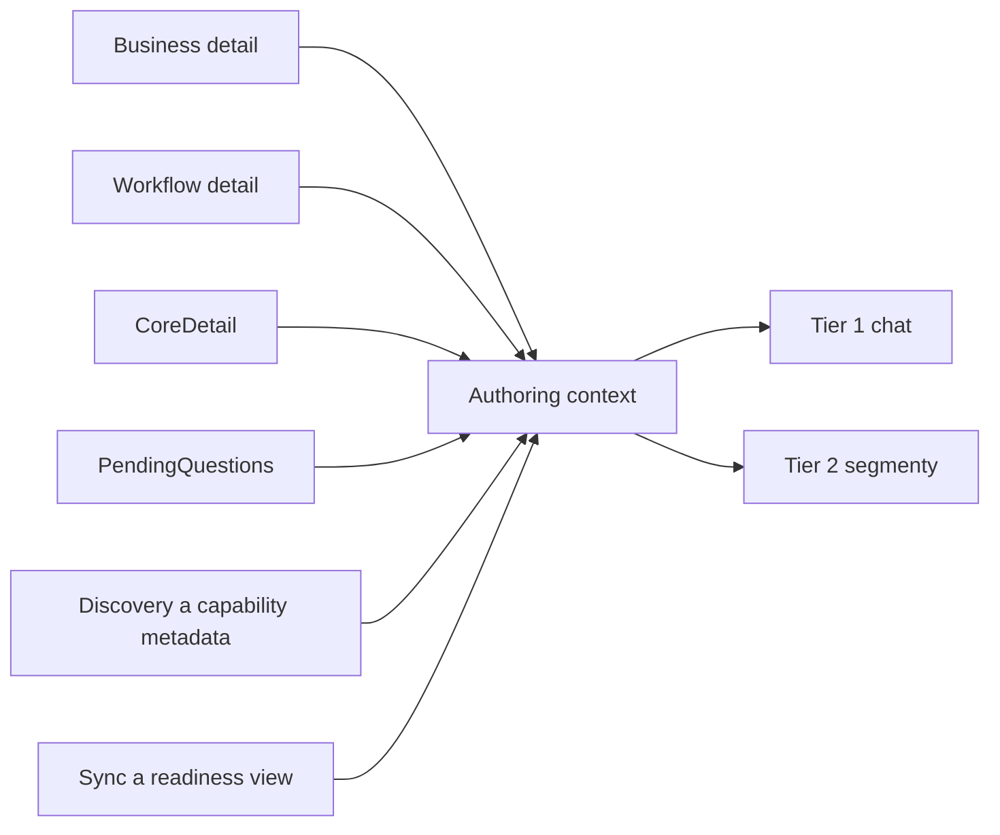

# MetaForge — AI vrstvová architektura a Provider model

Datum: 2026-04-17
Status: Živý dokument — aktualizováno 2026-04-28 (NodeAssist AiSegment)

---

## Vize

MetaForge je použitelný:
- **Standalone** — jako desktopový nástroj s lokálním AI
- **Jako nástroj pro vibe-coding aplikace** — embedded, headless, AI na míru hostitelské aplikaci
- **Jako backend pro agenty** — MCP surface, deterministická projekce, strukturovaný výstup

AI je v platformě **volitelná a vždy s graceful fallback** na deterministické (rule-based) chování. Žádné AI volání nesmí být předpokladem pro základní funkčnost.

V authoring-kernel směru AI nepracuje nad prázdným promptem, ale nad **projekcí skutečného stavu modelu**.

---

## AI nad synchronizovaným kontextem



### Důsledek

AI má být řízená projekcí synchronizovaného modelu, ne nutností znovu domýšlet stav systému z textové konverzace.

---

## Dvouúrovňová AI architektura

```
┌─────────────────────────────────────────────────────────────────┐
│  TIER 1 — Uživatelská AI (Chat)                                 │
│                                                                 │
│  MainChat segment → AiPlatformConfiguration.MainChat           │
│  ├── Online cloud AI (OpenAI, Azure, MiniMax, Claude...)        │
│  │   nebo lokální model (Ollama)                                │
│  ├── Uživatel interaguje VÝHRADNĚ zde                           │
│  └── Výstup: přirozený jazyk → BusinessPatchOperation[]        │
└───────────────────────────┬─────────────────────────────────────┘
                            │
                            ▼ strukturovaný výstup (patch commands)
┌─────────────────────────────────────────────────────────────────┐
│  TIER 2 — Interní specializované AI modely (background)         │
│                                                                 │
│  Uživatel NIKDY neinteraguje přímo s Tier 2 AI.                 │
│  Výstup Tier 2 je vždy strukturovaná data — ne volný text.     │
│                                                                 │
│  Segmenty:                                                      │
│  ├── ConstraintInference   → MethodConstraint[]                 │
│  ├── BodyGeneration        → ComputedExpression[]               │
│  ├── AuthoringTranslation  → BusinessPatchOperation[]           │
│  ├── Healing               → oprava generovaného kódu           │
│  ├── Prehealing            → pre-export validace kódu           │
│  ├── StyleImport           → extrakce stylu z cizího kódu       │
│  └── Conversation          → strukturovaná odpověď do chatu     │
└─────────────────────────────────────────────────────────────────┘
```

**Klíčový princip:** Tier 2 AI produkuje strukturovaná data (`MethodConstraint`, `ComputedExpression`, `BusinessPatchOperation`) — nikdy volný text pro uživatele. Toto zajistí, že AI odpovědi jsou deterministicky zpracovatelné bez ohledu na použitý model.

V novém směru to znamená také:

- Tier 1 má dostávat projekci business a workflow kontextu.
- Tier 2 má být schopné vracet nejen business patch operace, ale i workflow patch operace, enrichment commandy a capability binding suggestions.
- Discovery metadata mají být součástí vstupu pro rozhodování AI.

---

## Enterprise podpora

Tier 2 modely jsou záměrně navrženy pro **lokální provoz**:
- Výchozí provider: **Ollama** (`http://localhost:11434`)
- Výchozí modely: `qwen2.5-coder:7b` (inference), `Mistral:7b` (konverzace)
- Žádná závislost na síti pro Tier 2 — vhodné pro enterprise on-premise nasazení
- Tier 1 (MainChat) lze rovněž konfigurovat na lokální model

---

## Provider abstrakce

### Klíčové typy

```
MetaForge.Core.Configuration
├── AIInferenceSettings   — low-level nastavení jednoho backend volání
│   ├── Enabled: bool
│   ├── Provider: AIProvider
│   ├── Endpoint: string      (http://localhost:11434, https://api.openai.com/v1, ...)
│   ├── Model: string         (qwen2.5-coder:7b, gpt-4o, ...)
│   ├── ApiKey: string        (pro cloud providery)
│   ├── MaxTokens: int
│   ├── Temperature: float
│   └── TimeoutMs: int
└── AIProvider enum
    ├── Ollama    — lokální runtime (Qwen, Llama, Mistral, Phi)
    ├── OpenAI    — GPT-4o, GPT-4o-mini, ...
    ├── Azure     — Azure OpenAI Service
    ├── MiniMax   — MiniMax API
    └── Custom    — vlastní HTTP adaptér (Claude, Gemini, ...)

MetaForge.Ai.Runtime
├── IAiRuntimeAdapter     — nízkoúrovňová abstrakce HTTP volání
│   ├── IsAvailable: bool
│   ├── CompleteAsync(request) → AiCompletionResponse?
│   └── TestConnectionAsync() → bool
├── IAiRuntimeAdapterFactory  — factory z settings nebo segmentu
└── HttpAiRuntimeAdapter  — implementace (provider-aware HTTP)

MetaForge.Ai.Configuration
├── AiPlatformConfiguration   — centrální konfigurace všech segmentů
│   ├── GetSettingsForSegment(AiSegment) → AIInferenceSettings
│   ├── Load(filePath?) → AiPlatformConfiguration  (z appsettings.json)
│   └── vlastnosti per segment (viz AiSegment enum)
└── AiSegmentSettings     — nastavení jednoho segmentu (Enabled + AIInferenceSettings)
```

### AiSegment enum — registr segmentů

| Segment | Tier | Výstupní typ | Výchozí model |
|---------|------|-------------|---------------|
| `MainChat` | 1 | uživatelský text + patch commands | Mistral:7b (lokální) |
| `AuthoringTranslation` | 2 | `BusinessPatchOperation[]` | qwen2.5-coder:7b |
| `ConstraintInference` | 2 | `MethodConstraint[]` | qwen2.5-coder:7b |
| `BodyGeneration` | 2 | `ComputedExpression[]` | qwen2.5-coder:7b |
| `Healing` | 2 | opravený kód (strukturovaný) | qwen2.5-coder:7b |
| `Prehealing` | 2 | validační report | qwen2.5-coder:7b |
| `StyleImport` | 2 | style descriptor | Mistral:7b |
| `Conversation` | 2 | strukturovaná odpověď | Mistral:7b |
| `NodeAssist` | 2 | `NodeAssistResult` (strukturovaný návrh) | qwen2.5-coder:7b |

---

## Konfigurace z appsettings.json

```json
{
  "MetaForge": {
    "AI": {
      "ConstraintInference": {
        "Enabled": true,
        "Provider": "Ollama",
        "Endpoint": "http://localhost:11434",
        "Model": "qwen2.5-coder:7b",
        "Temperature": 0.2,
        "MaxTokens": 2048,
        "TimeoutMs": 30000
      },
      "MainChat": {
        "Enabled": true,
        "Provider": "OpenAI",
        "Endpoint": "https://api.openai.com/v1",
        "Model": "gpt-4o",
        "ApiKey": "...",
        "Temperature": 0.7,
        "MaxTokens": 8192,
        "TimeoutMs": 120000
      }
    }
  }
}
```

Konfigurace se načítá přes `AiPlatformConfiguration.Load()`. Pokud soubor neexistuje, použijí se výchozí hodnoty (vše Ollama, vše lokální).

---

## Jak přidat nový AI segment

Při přidání nové interní AI funkce (Tier 2):

1. **Přidej hodnotu do `AiSegment` enum** v `MetaForge.Ai/Configuration/AiPlatformConfiguration.cs`
2. **Přidej property** `public AiSegmentSettings NovýSegment { get; set; } = new() { ... }` do `AiPlatformConfiguration`
3. **Přidej case** v `GetSettingsForSegment()` switch
4. **Přidej case** v `CloneSegmentSettings()` pokud existuje clone logika
5. **Implementuj** logiku jako třídu implementující příslušný interface z Core (analog `IConstraintInferencer`)
6. **Registruj** přes factory delegát — ne přímou závislost na `MetaForge.Ai` z Core

Každý nový segment musí:
- Vracet **strukturovaná data**, nikdy volný text pro uživatele
- Mít `IsAvailable` check a graceful fallback (prázdný výsledek nebo rule-based alternativa)
- Být konfigurovatelný per-segment v `appsettings.json`

Při návrhu nového segmentu se nově ptát i na to, zda pracuje nad:

- business authoring kontextem,
- workflow kontextem,
- pending questions,
- capability discovery,
- readiness stavem pro konkrétní výstup.

---

## Dependency pravidla

```
MetaForge.Core        ← zná pouze AIInferenceSettings, AIProvider, IConstraintInferencer
MetaForge.Ai          ← implementuje runtime, závisí na Core.Configuration
MetaForge.Builders    ← závisí na MetaForge.Ai (AiBuilder, IAiRuntimeAdapter)
MetaForge.Translator  ← závisí na MetaForge.Ai pro AuthoringTranslation segment
MetaForge.Mcp         ← závisí na MetaForge.Ai pro MainChat segment
MetaForge.Chat        ← závisí na MetaForge.Ai pro MainChat + Conversation
```

**Nesmí:** Core záviset na MetaForge.Ai implementaci. Registrace AI do Core probíhá vždy přes factory delegát nebo DI.

---

## Vztah k ForgeBlock balíčkům

ForgeBlock balíčky mohou v budoucnu přidat vlastní AI segment — např. `OrmQueryGeneration` nebo `ApiEndpointSuggestion`. Postup:
1. ForgeBlock definuje vlastní `IXyzAiContributor` interface (analogicky `IConstraintInferencer`)
2. `MetaForge.Ai` poskytne implementaci přes `IAiRuntimeAdapter`
3. Segment se přidá do `AiSegment` enum a `AiPlatformConfiguration`

Toto je součástí plánované multi-vrstvé registrace ForgeBlock balíčků — viz [05-ForgeBlock-Package-Model.md](05-ForgeBlock-Package-Model.md).

---

## Agent surface v kontextu MetaForge

MetaForge nemá být AI agent framework sám o sobě. `Agent surface` zde znamená, že host surface a discovery vrstva umí vystavit schopnosti MetaForge tak, aby je jiný AI klient mohl bezpečně používat jako sadu nástrojů.

To je důležité, ale nemá to měnit základní architektonický princip:

- source of truth zůstává v authoring dokumentu a command logu,
- agent pouze používá host surface,
- discovery je zdroj toho, co agent může dělat,
- write-back a replay drží auditovatelný stav změn.

---

## LoRA adaptery per ForgeBlock balíček

### Myšlenka

Každý ForgeBlock balíček může nést **LoRA adaptery pro vybrané Tier 2 base modely**. Adapter naučí model kanonickou notaci balíčku (`mf.math.sqrt`, `mf.mapper.map`...) a správnou strukturu `codeGenerationActions[]` JSON pro danou doménu.

Adapter je **součástí NuGet balíčku** — verzovaný spolu s API. Pokud se změní `codeGenerationActions` schéma nebo kanonické handles, vydá se nová verze balíčku s novým adapterem.

```csharp
public interface IForgeBlockAiAdapterPackage
{
    void RegisterAiAdapters(IForgeBlockAiAdapterRegistry registry);
}

// IForgeBlockAiAdapterRegistry
public interface IForgeBlockAiAdapterRegistry
{
    // Registrace LoRA adapteru pro konkrétní base model
    void AddLoraAdapter(ForgeBlockLoraAdapterDescriptor descriptor);
}

public sealed record ForgeBlockLoraAdapterDescriptor(
    string PackageId,          // "builtin.math"
    string BaseModelId,        // "llama3.1:8b", "qwen2.5-coder:7b", "phi-4"
    string AdapterPath,        // relativní cesta k .gguf / safetensors souboru v balíčku
    string[] SupportedSegments // AiSegment.BodyGeneration, AiSegment.ConstraintInference
);
```

### Jak to funguje za runtime

```
Host při startu:
├── Detekuje base model z AiPlatformConfiguration (pro každý Tier 2 segment)
├── Pro každý registrovaný ForgeBlock:
│   └── Pokud balíček implementuje IForgeBlockAiAdapterPackage:
│       └── Hledá adapter pro aktuální base model
│           ├── Nalezen → Ollama/llama.cpp načte LoRA adapter (--lora flag)
│           └── Nenalezen → standard prompt injection (discovery capabilities do promptu)
```

### Proč verzování balíčku řeší udržovatelnost

| Problém bez verzování | Řešení s balíčkem |
|---|---|
| Schema `codeGenerationActions[]` se změní → adapter generuje špatný JSON | Nová verze balíčku = nový adapter + nové schema |
| Přidá se nová math funkce (`mf.math.cbrt`) → adapter ji nezná | SemVer minor bump → nový adapter |
| Uživatel má starou verzi → adapter neodpovídá API | Dependency resolution (NuGet) zabrání nekonzistenci |

### Dataset

Dataset pro trénování LoRA adapterů si **spravuje vydavatel balíčku** (pro built-in: MetaForge tým). Dataset není součástí NuGet balíčku — je zdrojem pro build pipeline. Balíček obsahuje pouze výsledný adapter.

### Prerekvizity

- Stabilní `codeGenerationActions[]` JSON schéma
- Ollama nebo llama.cpp runtime s podporou `--lora` při Tier 2 inference
- `IForgeBlockAiAdapterRegistry` + detekce base modelu v `AiPlatformConfiguration`

---

## Otevřené otázky

- OQ-010 (viz [04-OpenQuestions.md](04-OpenQuestions.md)) — kde přesně leží hranice Tier 1 / Tier 2 pro budoucí segmenty (např. katalog suggestion při chatu)?

---

## Existující kód — kde to žije dnes

> Při implementaci změn začni od těchto souborů — nepřepisuj, ale přesuň a uprav.

| Co | Soubor | Poznámka |
|----|--------|----------|
| `IConstraintInferencer` | `Src/MetaForge.Core/Inference/IAiConstraintInferencer.cs` | Interface v Core — nezávislý na implementaci |
| `AIInferenceSettings`, `AIProvider` | `Src/MetaForge.Core/Configuration/AIInferenceSettings.cs` | Low-level settings — patří do Core |
| `AiConstraintInferencer` | `Src/MetaForge.Ai/AiConstraintInferencer.cs` | Tier 2 implementace pro ConstraintInference segment |
| `IAiRuntimeAdapter`, `IAiRuntimeAdapterFactory` | `Src/MetaForge.Ai/Runtime/IAiRuntimeAdapter.cs` | HTTP abstrakce nad backend providerem |
| `HttpAiRuntimeAdapter` | `Src/MetaForge.Ai/Runtime/HttpAiRuntimeAdapter.cs` | Concrete HTTP implementace (Ollama, OpenAI, MiniMax...) |
| `AiRuntimeAdapterFactory` | `Src/MetaForge.Ai/Runtime/AiRuntimeAdapterFactory.cs` | Factory z settings nebo segmentu |
| `AiPlatformConfiguration`, `AiSegment` | `Src/MetaForge.Ai/Configuration/AiPlatformConfiguration.cs` | Centrální konfigurace + AiSegment enum |
| `AIBoundaryAnalyzer` | `Src/MetaForge.Core/Inference/Boundary/DomainAnalyzers/AIBoundaryAnalyzer.cs` | Tier 2 bridge — volá IConstraintInferencer z Core boundary systému |
| `MethodBoundaryAnalyzer` | `Src/MetaForge.Core/Inference/Boundary/MethodBoundaryAnalyzer.cs` | Orchestrátor — `CreateWithAI(inferencer)` factory |
| `AiBuilder` | `Src/MetaForge.Builders/Adapters/AiBuilder.cs` | Fluent builder adapter pro AI inference — `LoadSegment(AiSegment)` |
