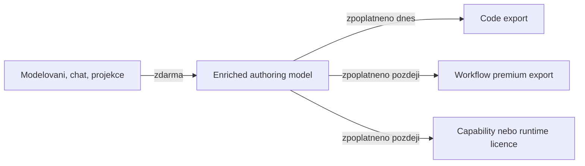

# MetaForge — Monetizace a kreditový systém

Datum: 2026-04-17
Status: Živý dokument — základ existuje, gate před generací chybí

---

## Vize

Platforma je **zdarma k používání** — modelování domény, chat, projekce, náhled Business Tree — vše bez poplatku.

**Platí se za generaci finálního kódu** — export do `.cs`, `.ts`, `.py`, `.java`, `.go`. Cena závisí na:
- Složitosti modelu (počet tříd, metod, properties, ForgeBlock capabilities...)
- Cílovém jazyce (multiplikátor per jazyk)

Toto funguje jak pro **standalone** použití (lokální kreditový účet / licence), tak pro **cloud / SaaS** (billing API) i **marketplace presety** (každý preset má svou cenu).

V authoring-kernel směru se tato logika nemá rozbít, ale rozšířit: neplatí se za samotné modelování, ale za okamžik, kdy se model mění ve finální nebo provozně hodnotný výstup.



### Rozšířené čtení monetizace

| Vrstva hodnoty | Stav | Typ monetizace |
|----------------|------|----------------|
| Modelování a projekce | dnes | zdarma |
| Code export | dnes | kreditový model |
| Prémiové workflow exporty | cílový směr | export fee nebo vyšší license tier |
| Marketplace presety | částečně připraveno | per-item cost |
| Capability nebo runtime balíčky | cílový směr | licence nebo entitlement |

---

## Jak se počítají kredity

### Úroveň 1 — Element credit score (Core)

Každý top-level element nese svou základní kreditovou hodnotu:

| Element | Výchozí `CreditScore` | Pozn. |
|---------|----------------------|-------|
| `Class` (POCO) | 10 | `PresetFactory` |
| `Class` (DomainModel) | 20 | `PresetFactory` |
| `Struct` | 15 | `Struct.cs` |
| `Enum` | ❌ chybí | nutno doplnit |
| `Interface` | ❌ chybí | nutno doplnit |

### Úroveň 2 — Member credit score (součet uvnitř elementu)

`Class.CalculateTotalCreditScore()` sčítá:

```
CreditScore
+ Fields.Count × 1
+ Properties.Count × 2
+ Methods.Count × 5
+ Constructors.Count × 3
```

Obdobně `Struct.CalculateTotalCreditScore()`.

### Úroveň 3 — Package total

`Package.TotalCreditScore` = suma `CalculateTotalCreditScore()` přes všechny třídy ve všech vrstvách (Domain, Database, Contract, Service, Api) + DomainModel.

```csharp
// Package.RecalculateCreditScore() — voláno při každé změně
total += DomainModel.CalculateTotalCreditScore();
foreach (var layer in Layers.Values)
    foreach (var cls in layer)
        total += cls.CalculateTotalCreditScore();
```

### Úroveň 4 — Jazykový multiplikátor (Generator)

Každý generátor nese `CreditCostPerElement`:

| Jazyk | Multiplikátor |
|-------|--------------|
| C# | 1× |
| TypeScript | 2× |
| Python | 2× |
| Java | 2× |
| Go | 3× |

### Výsledná cena generace

```
generationCost = Package.TotalCreditScore × Generator.CreditCostPerElement
```

**Toto spojení dnes v kódu chybí** — viz sekce "Co chybí".

---

## Co chybí — nutno implementovat

### 1. `IGenerationCostPolicy` — gate před generací

Pluginové rozhraní pro kontrolu a odečtení kreditů. Core ani Generators o billing neví — implementace je vnější.

```csharp
// Navrhované rozhraní — žije v MetaForge.Core nebo MetaForge.Generators
public interface IGenerationCostPolicy
{
    /// <summary>Spočítá cenu generace bez provedení platby.</summary>
    int CalculateCost(int modelCreditScore, int languageMultiplier);

    /// <summary>Zkontroluje zda může uživatel generovat. Vrátí false pokud nemá dost kreditů.</summary>
    Task<bool> CanGenerateAsync(string? userId, int cost, CancellationToken ct = default);

    /// <summary>Odečte kredity po úspěšné generaci.</summary>
    Task DeductAsync(string? userId, int cost, CancellationToken ct = default);
}

// Standalone implementace — vždy povolí
public sealed class AlwaysAllowGenerationPolicy : IGenerationCostPolicy { ... }

// Cloud implementace — volá billing API
public sealed class CloudBillingGenerationPolicy : IGenerationCostPolicy { ... }

// Lokální licence — odečítá z lokálního souboru
public sealed class LocalLicenseGenerationPolicy : IGenerationCostPolicy { ... }
```

### 2. Gate v `BusinessAuthoringHostFacade`

Před voláním generátoru:

```csharp
// Navrhovaný tok v BusinessAuthoringHostFacade.GenerateCodeAsync()
var modelScore = package.TotalCreditScore;
var multiplier = generator.CreditCostPerElement;
var cost = _costPolicy.CalculateCost(modelScore, multiplier);

if (!await _costPolicy.CanGenerateAsync(userId, cost, ct))
    return GenerationResult.InsufficientCredits(cost);

var code = generator.Generate(element);
await _costPolicy.DeductAsync(userId, cost, ct);
return GenerationResult.Success(code, cost);
```

### 3. `Enum` a `Interface` — doplnit `CreditScore`

Dnes chybí kreditová hodnota pro `EnumMF` a `Interface`. Navrhované hodnoty:

| Element | Navrhovaný `CreditScore` |
|---------|------------------------|
| `EnumMF` | 5 (enum je jednoduchý) |
| `Interface` | 8 (kontrakt bez implementace) |

### 4. `CatalogItem.CreditCost` — marketplace presety

`CatalogItem.CreditCost` již existuje. Presety z marketplace mají nenulovou cenu — tato cena se přičte ke generační ceně nebo odečte jako jednorázový nákup při aplikaci presetu. Rozhodnutí viz OQ-009.

### 5. Output-aware billing policy

Pokud MetaForge začne vydávat více typů výstupů, bude potřeba držet billing policy odděleně per output type.

Pracovní směr:

- `CodeExportCostPolicy`
- `WorkflowExportCostPolicy`
- `RuntimeLicensePolicy`

Stále ale platí guardrail: billing nesmí pronikat do Core sémantiky ani do command logu.

---

## Deployment varianty a `IGenerationCostPolicy`

| Varianta | Implementace policy | Chování |
|----------|---------------------|---------|
| Standalone (OSS/trial) | `AlwaysAllowGenerationPolicy` | Vždy povolí, nepočítá |
| Standalone (lokální licence) | `LocalLicenseGenerationPolicy` | Odečítá z `~/.metaforge/license.json` |
| SaaS / cloud | `CloudBillingGenerationPolicy` | REST volání billing API |
| Enterprise on-premise | `EnterpriseLicenseGenerationPolicy` | Licence soubor nebo LDAP |
| Vibe-coding host | Hostitel injektuje vlastní policy | Plná kontrola hostitele |

Policy se injektuje při startu hostitele — ne drátovaná v platformě.

---

## Zobrazení ceny uživateli

Před generací by měl uživatel vidět preview ceny:

```
Projekt: OrderManagement
  Třídy: 8  (Methods: 42, Properties: 67)
  Celkové skóre: 347 kreditů
  Jazyk: TypeScript (×2)
  ─────────────────────────
  Cena generace: 694 kreditů
  Váš zůstatek: 1200 kreditů ✓
```

Toto patří do MCP tool (`EstimateGenerationCost`) a CLI (`metaforge estimate --lang ts`).

---

## Fáze implementace

| Fáze | Obsah | Prerekvizita |
|------|-------|--------------|
| M1 | `EnumMF.CreditScore` + `Interface.CreditScore` | — |
| M2 | `IGenerationCostPolicy` interface v Core nebo Generators | — |
| M3 | `AlwaysAllowGenerationPolicy` (standalone) | M2 |
| M4 | Gate v `BusinessAuthoringHostFacade.GenerateCodeAsync()` | M2, M3 |
| M5 | `GenerationCostEstimate` DTO + `EstimateGenerationCost` MCP tool | M2 |
| M6 | CLI `metaforge estimate` příkaz | M5 |
| M7 | `LocalLicenseGenerationPolicy` | M2 |
| M8 | `CloudBillingGenerationPolicy` + billing API | M2, M7 |

---

## Existující kód — kde to žije dnes

> Při implementaci začni od těchto souborů — základ je hotový, chybí gate a policy abstrakce.

| Co | Soubor | Poznámka |
|----|--------|----------|
| `Class.CreditScore` + `CalculateTotalCreditScore()` | `Src/MetaForge.Core/Elements/Types/Class.cs` | Základ credit modelu |
| `Struct.CreditScore` + `CalculateTotalCreditScore()` | `Src/MetaForge.Core/Elements/Types/Struct.cs` | Totéž pro struct |
| `Package.TotalCreditScore` + `RecalculateCreditScore()` | `Src/MetaForge.Core/Common/Package.cs` | Agregace přes všechny vrstvy |
| `PresetFactory` — výchozí `CreditScore` hodnoty | `Src/MetaForge.Core/Common/PresetFactory.cs` | POCO=10, DomainModel=20, ... |
| `BaseCodeGenerator.CreditCostPerElement` | `Src/MetaForge.Generators/BaseCodeGenerator.cs` | Jazykový multiplikátor (abstract) |
| Jazykové multiplikátory | `Src/MetaForge.Generators/CSharp/CSharpGenerator.cs` (=1), `TypeScript/` (=2), `Python/` (=2), `Java/` (=2), `Go/` (=3) | Konkrétní hodnoty |
| `TransportContracts.CreditScore` | `Src/MetaForge.Dto/TransportContracts.cs` | DTO nese score — mapován v TransportCoreMapper |
| `CatalogItem.CreditCost` | `Src/MetaForge.Core/Catalog/CatalogItem.cs` | Cena marketplace presetu |
| `Interface.cs` (bez CreditScore) | `Src/MetaForge.Core/Elements/Types/Interface.cs` | Nutno doplnit |
| `EnumMF.cs` (bez CreditScore) | `Src/MetaForge.Core/Elements/Types/EnumMF.cs` | Nutno doplnit |
