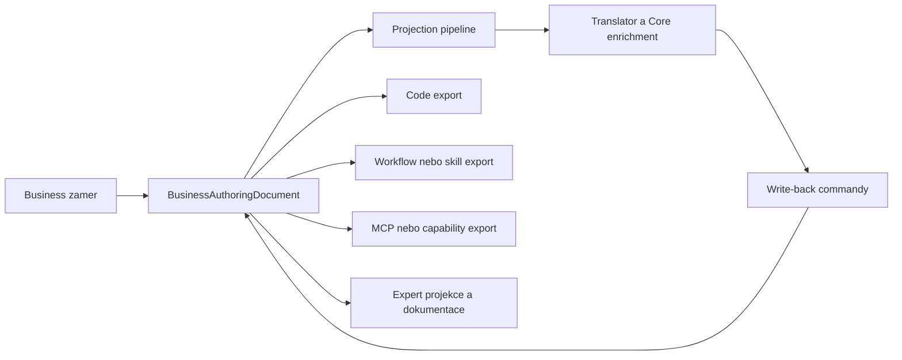
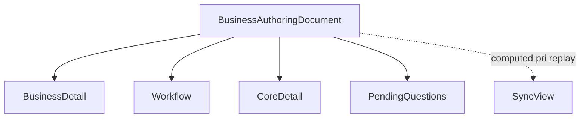
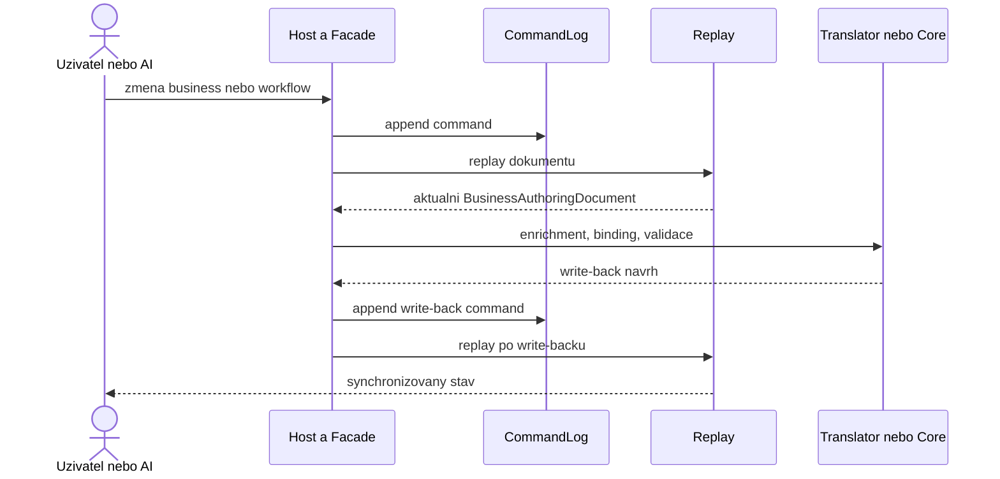
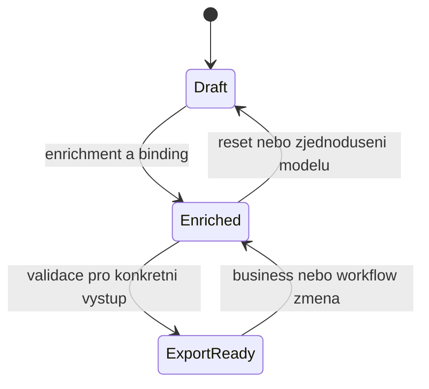
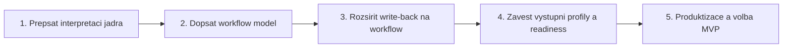

# MetaForge — Authoring Kernel, Workflow a více výstupů

Datum: 2026-04-27
Status: Živý dokument — aktualizováno 2026-04-28 (Node Assist implementováno + WebApi)

---

## Účel

Tento dokument formalizuje posun MetaForge z čistě business-first codegen platformy na **business-first authoring kernel**.

Smyslem změny není opustit současné jádro, ale rozšířit jeho interpretaci:

- `BusinessAuthoringDocument` zůstává source of truth,
- `CommandLog` zůstává append-only historií změn,
- replay zůstává způsobem rekonstrukce stavu,
- write-back zůstává mechanismem, kterým se enrichment vrací zpět do business vrstvy,
- codegen zůstává důležitým výstupem,
- ale není jediným legitimním cílem celé platformy.

---

## Co se nemění

Nový směr zachovává tyto invarianty:

- uživatel pracuje primárně v business vrstvě,
- Core zůstává jazykově agnostické,
- host surface zůstává tenká,
- AI zůstává volitelná a musí mít graceful fallback,
- Tier 2 AI vrací pouze strukturovaná data,
- invalidní model se nesmí exportovat jako vykonatelný artefakt.

To znamená, že nejde o novou platformu, ale o nové čtení a rozšíření stávající platformy.

---

## Nové čtení platformy

Původní dominantní tok byl čten převážně takto:

```text
business model -> core -> code generation
```

Nové cílové čtení je širší:

```text
business model + workflow -> replaynutý authoring dokument -> enrichment a write-back -> výstup podle cíle
```



### Důsledek

MetaForge se nemá chápat jen jako generátor zdrojových souborů, ale jako authoring a synchronizační jádro, které z business záměru vytváří více typů artefaktů.

---

## BusinessAuthoringDocument jako bohatší zdroj pravdy

`CommandLog` nemá mít sekce. Je to historie příkazů.

Sekce patří do `BusinessAuthoringDocument`, který vzniká replayem commandů.

### Doporučené sekce dokumentu

| Sekce | Typ obsahu | Poznámka |
|-------|------------|----------|
| `BusinessDetail` | entity, atributy, vztahy, chování, poznámky | hlavní authoring vrstva |
| `Workflow` | kroky, vazby, podmínky, integrační body, schvalování | nová first-class sekce |
| `CoreDetail` | resolved typy, presety, capability bindingy, validační metadata | vzniká write-backem |
| `PendingQuestions` | chybějící rozhodnutí, konflikty, nejasnosti | explicitní backlog otevřených bodů |
| `SyncView` | computed sync a readiness metadata | odvozený pohled při replay |



### Důležité pravidlo

`SyncView` není ručně authorovaná data. Je to odvozená vrstva podobně jako dnešní `AttributeSyncState`.

---

## Workflow jako first-class citizen

Workflow nesmí zůstat neformálním promptem nebo poznámkou v dokumentaci. Má být synchronizovanou součástí modelu.

### Workflow musí nést

- strukturu kroků,
- pořadí nebo závislosti,
- podmínky a větvení,
- vazby na business entity a atributy,
- vazby na capability a tools,
- lidské schvalovací body,
- integrační body,
- write-back bindingy z nižších vrstev.

### Proč je to užitečné

Bez synchronizovaného workflow:

- AI nezná procesní kontext,
- nelze auditovat rozhodovací tok,
- workflow se rozpadne na text mimo source of truth,
- další exporty nemají nad čím stavět.

Se synchronizovaným workflow získá MetaForge druhý silný rozměr vedle datového a strukturálního modelu: model záměrného postupu.

---

## Write-back jako obecný synchronizační vzor

Původní logika platformy je správná:

1. změna vznikne v business vrstvě,
2. uloží se jako command,
3. replay vytvoří aktuální dokument,
4. translator nebo Core dopočítá enrichment,
5. výsledek se vrátí zpět jako write-back command,
6. replay vytvoří nový synchronizovaný stav.



### Rozšíření vzoru

To, co dnes začíná u `BusinessAttributeNode.CoreDetail`, se má rozšířit i na workflow:

- workflow bindingy,
- capability mapping,
- export readiness,
- diagnostické a validační metadata.

---

## Výstupní profily místo jediného konce

Z jednoho authoring modelu mohou vznikat různé výstupy. Tyto výstupy mají odlišné cílové skupiny, ale společný vstup a společný synchronizační model.

| Výstup | Příjemce | Typická hodnota |
|--------|----------|-----------------|
| Zdrojový kód | vývojář, tým | finální implementace |
| Workflow nebo skill export | enterprise, operations | automatizace procesu |
| MCP nebo capability export | AI klient, host aplikace | bezpečný tool calling |
| Expert projekce a diagnostika | architekt, analytik, AI | porozumění modelu a chybějícím datům |
| Dokumentace a vizualizace | stakeholder, onboarding | sdílené porozumění bez čtení kódu |

### Readiness model

Ne každý výstup potřebuje stejnou míru detailu. Doporučený model:



| Stav | Co znamená | Typické výstupy |
|------|-------------|-----------------|
| `Draft` | základní authoring bez hlubšího enrichmentu | tree, dokumentace, chat context |
| `Enriched` | existuje typový nebo workflow binding detail | expert view, workflow export, návrhy |
| `ExportReady` | validace pro konkrétní výstup prošla | codegen, capability export, vykonatelný workflow artefakt |

---

## Workflow a codegen se nevylučují

Workflow a kód nejsou konkurenční směry.

- workflow může být primární návrhová vrstva,
- codegen je přísnější exportní režim nad stejným základem,
- technický detail se může dopočítat až ve chvíli, kdy je opravdu potřeba,
- write-back vrací enrichment zpět do authoring modelu.

To znamená, že MetaForge může dlouho fungovat jako business a workflow authoring prostředí a codegen se spustí až v okamžiku, kdy model dosáhne příslušné export readiness.

---

## AI jako konzument i producent strukturovaného kontextu

AI nemá pracovat jen nad chatem, ale nad projekcí skutečného stavu modelu.

### AI má dostávat

- business detail,
- workflow detail,
- `PendingQuestions`,
- `CoreDetail`,
- discovery dostupných capability a tools,
- sync a readiness metadata.

### AI má vracet

- `BusinessPatchOperation[]`,
- workflow patch operace,
- enrichment commandy,
- capability binding suggestions,
- validační doporučení,
- kroky potřebné k dosažení `ExportReady`.

Tím se AI neposouvá k větší magii, ale k větší autonomii nad explicitní strukturou.

---

## Node-level asistence jako lokální authoring režim ✅

Node-level assist je **implementovaný** jako lokální preview režim nad stejným `BusinessAuthoringDocument` a stejnou projection pipeline. Není samostatný editor ani skrytý authoring kanál.

### Co to znamená

- uživatel zůstává v node formuláři nebo jiné host surface nad konkrétním uzlem,
- systém sestaví úzký node-scoped kontext z aktuální projekce (`NodeAssistContextBuilder`),
- AI (`NodeAssistService`) nebo deterministická suggestion (`NodePresetSuggester`) vrátí návrh hodnot,
- potvrzená změna se zapíše stejnou write cestou přes `ApplyNodeAssistOperations` → `CommandLog`.

### Implementované komponenty

| Komponenta | Soubor | Odpovědnost |
|------------|--------|-------------|
| `NodeAssistContextBuilder` | `Src/MetaForge.Translator/Host/NodeAssistContextBuilder.cs` | Sestaví node-scoped kontext z `ProjectionView` |
| `NodeAssistService` | `Src/MetaForge.Translator/Conversation/NodeAssistService.cs` | Volá AI s node-scoped promptem |
| `NodeAssistModelPrompt` | `Src/MetaForge.Translator/Prompting/ModelPrompts/NodeAssistModelPrompt.cs` | System + user prompt s JSON kontextem |
| `NodeAssistResult` | `Src/MetaForge.Translator/Conversation/NodeAssistResult.cs` | Strukturovaný AI response |
| `NodeAssistOperationScopeValidator` | `Src/MetaForge.Translator/Conversation/NodeAssistOperationScopeValidator.cs` | Sanitizace AI outputu v preview stage |
| `NodeAssistOperationValidator` | `Src/MetaForge.Translator/Host/NodeAssistOperationValidator.cs` | Whitelist + entity scope check před apply |
| `AssistNodeAsync` | `Src/MetaForge.Translator/Host/BusinessAuthoringHostFacade.cs` | Facade vstupní bod pro preview |
| `ApplyNodeAssistOperations` | `Src/MetaForge.Translator/Host/BusinessAuthoringHostFacade.cs` | Facade vstupní bod pro explicit apply |

### Povinné guardrails (dodržováno)

- ✅ Node assist čte přes `GetProjectionAsync`, žádná druhá read pipeline.
- ✅ Node assist píše přes `ApplyOperations` → `CommandLog`, žádná druhá write pipeline.
- ✅ `NodeAssistContext` je odvozený preview model, ne nová source of truth.
- ✅ Host surface zůstává tenká: MCP, chat, WebApi i UI jen předají request, zobrazí preview a po potvrzení zavolají existující write surface.
- ✅ AI vrací strukturovaný návrh (`BusinessPatchOperation[]`) pro jeden node nebo explicitně povolený podstrom.
- ✅ Deterministický fallback: pokud AI není dostupná, `AssistNodeAsync` vrací `NodeAssistProposal` bez `AiResult`.

### Doporučený tok

```text
uzivatel otevre node
    -> host preda node request do facade (AssistNodeAsync)
    -> facade ziska ProjectionView nad aktualnim stavem
    -> NodeAssistContextBuilder vyrizne lokalni kontext
    -> NodeAssistService zavola AI s node-scoped promptem
    -> AI vrati NodeAssistResult s ProposedOperations
    -> NodeAssistOperationScopeValidator sanitizuje operace
    -> uzivatel potvrdi apply
    -> ApplyNodeAssistOperations validuje (NodeAssistOperationValidator)
    -> ApplyOperations se zapise do CommandLog
    -> replay vytvori novy synchronizovany stav
```

### Co node-scoped kontext obsahuje

- vybraný node a jeho aktuální hodnoty (`Attribute`/`Behavior` projection),
- parent entity a stručný sibling summary,
- relevantní discovery nebo preset hints (`DiscoveryContext`),
- kompaktní authoring context nad workflow, pending questions a readiness,
- pouze minimum okolního kontextu potřebného pro kvalitní návrh.

### Host surface pro node assist

| Surface | Název | Typ |
|---------|-------|-----|
| MCP tool | `AssistNode` | Read-only preview |
| MCP tool | `ApplyNodeAssist` | Write — explicit apply |
| MCP tool | `SuggestNodePresets` | Deterministický suggestion |
| Chat | `assist <path> <prompt>` | Read-only preview |
| WebApi | `POST /assist` | Read-only preview |
| WebApi | `POST /assist/apply` | Write — explicit apply |
| WebApi | `POST /presets/suggest` | Deterministický suggestion |

### Produktový význam

Tento režim překládá authoring kernel do jemnější ergonomie: MetaForge není odkázaný jen na velký chat nebo ruční formulářové vyplňování. Lokální asistence nad jedním uzlem neporušuje source of truth, replay ani write-back principy.

---

## HTTP Web API pro Frontend

Pro samostatný frontend projekt (React, Vue, Angular, Blazor) je potřeba HTTP API, které vystaví `BusinessAuthoringHostFacade` jako REST/JSON endpointy.

### Proč Minimal API

- Tenká vrstva — handler je 3–5 řádků, žádná business logika.
- JSON přes HTTP, CORS, Swagger/OpenAPI — frontend-friendly.
- Aspire integrace — `builder.AddProject(...)` out-of-box.
- Session-based — odpovídá současné CLI/MCP architektuře (1 dokument v paměti).

### Architektura

```
Frontend SPA ──HTTP/JSON──► MetaForge.WebApi ──► BusinessAuthoringHostFacade
```

### Endpointy

| Method | Path | Facade metoda |
|--------|------|---------------|
| GET | `/document` | `GetCurrentReadDocumentJson()` |
| GET | `/document/tree` | `GetCurrentTree()` |
| GET | `/document/projection` | `GetProjectionAsync(options)` |
| POST | `/entities` | `AddEntity(...)` |
| DELETE | `/entities/{id}` | `DeleteEntity(...)` |
| PATCH | `/entities/{id}` | `UpdateEntity(...)` |
| POST | `/entities/{id}/attributes` | `AddAttribute(...)` |
| POST | `/entities/{id}/behaviors` | `AddBehavior(...)` |
| POST | `/relations` | `AddRelation(...)` |
| POST | `/assist` | `AssistNodeAsync(...)` |
| POST | `/assist/apply` | `ApplyNodeAssistOperations(...)` |
| POST | `/presets/suggest` | `SuggestNodePresets(...)` |
| POST | `/operations` | `ApplyOperations(...)` |

### Konfigurace

- `MetaForge:Cors:AllowedOrigins` — CORS policy pro dev/prod.
- `MetaForge:AuthoringConfigPath` — cesta k AI konfiguraci (volitelné).
- `ASPNETCORE_ENVIRONMENT=Development` — zapne Swagger UI.

### Spuštění

```bash
# Přímo (bez Aspire workloadu)
dotnet run --project Src/MetaForge.WebApi/MetaForge.WebApi.csproj

# Přes Aspire (vyžaduje `dotnet workload install aspire`)
dotnet run --project Src/MetaForge.AppHost/MetaForge.AppHost.csproj
```

Swagger UI: `http://localhost:5000/swagger`

---

## Frontend Authoring Studio (ve vývoji)

HTTP Web API je technický základ pro samostatné webové authoring studio. Tento směr je **ve vývoji**: architektonicky je žádoucí, ale není ještě považovaný za hotový host surface ani za finální produktové MVP.

Frontend Authoring Studio se má číst jako **workspace nad stejným authoring kernelem**, ne jako nová source of truth:

- čte přes `MetaForge.WebApi`, ne přímo z interního modelu,
- zapisuje pouze přes existující façade a `CommandLog` cestu,
- kombinuje model, workflow, diagnostiku, pending questions a node assist preview v jednom UI,
- nepřidává vlastní business logiku mimo host surface a query orchestration.

Prakticky to znamená, že Web API není konečný produkt, ale jeden z předpokladů pro lidsky orientovaný authoring workspace vedle MCP, CLI a dalších host surfaces.

Detail konceptu, guardrails a otevřených bodů je v `11-Frontend-Authoring-Studio.md`.

---

## ForgeBlock jako capability a runtime balíčky

ForgeBlock se má číst méně jako „codegen contributor“ a více jako „capability balíček“, který může přispět do více vrstev stejné platformy.

### ForgeBlock ideálně přispívá do těchto oblastí

- capability metadata,
- discovery metadata,
- katalog a presety,
- codegen contributory,
- translator pravidla,
- workflow bindingy,
- host-specific mapování do MCP nebo CLI,
- volitelně AI adaptery.

To posouvá MetaForge od šablonové platformy k modulárnímu authoring ekosystému.

---

## Produktová disciplína

Architektonicky může MetaForge obsloužit více režimů, ale produktově se nesmí prodávat jako všechno pro všechny.

### Doporučené čtení režimů

| Režim | Hlavní výstup | Doporučení |
|------|---------------|------------|
| Builder | zdrojový kód | hlavní veřejné MVP |
| Analyst | projekce a diagnostika | doprovodné veřejné MVP |
| Orchestrator | workflow a procesní automatizace | připravit architekturu, nekomunikovat jako hotový produkt |
| Agent Host | MCP a capability surface | připravit architekturu, produktově až později |

---

## Doporučené implementační fáze



| Fáze | Obsah |
|------|-------|
| 1 | přepsat architektonický jazyk na authoring kernel |
| 2 | zavést workflow uzly, commandy a projekce |
| 3 | zavést workflow binding write-back |
| 4 | oddělit `Draft`, `Enriched`, `ExportReady` per output |
| 5 | veřejně držet Builder + Analyst, ostatní směry jen jako připravenost |

---

## Co tento dokument vědomě neřeší

Tento směr není plánem pro:

- nový AI-native programovací jazyk,
- neuronový runtime místo klasického software stacku,
- plný execution operating system pro agenty,
- úplné reverzní odvozování business a workflow modelu z libovolného kódu.

Tyto myšlenky mohou být dlouhodobým výzkumným horizontem, ale nemají brzdit současný authoring kernel.

---

## Související dokumenty

- `00-Platform-Overview.md`
- `01-Layers.md`
- `02-Projection-Pipeline.md`
- `03-CoreDetail-WriteBack.md`
- `05-ForgeBlock-Package-Model.md`
- `06-AI-Tiers-and-Providers.md`
- `07-Monetization-Credits.md`
- `11-Frontend-Authoring-Studio.md`
- `TentativePlan.md`