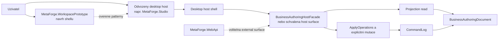

# MetaForge — Authoring Studio Host

Datum: 2026-04-30
Status: Živý dokument — desktop-first směr ukotven, 21A prototype existuje

---

## Účel

Tento dokument ukotvuje aktuální host směr pro lidské authoring studio v MetaForge. Primární cesta už není web-first SPA, ale desktop-first workspace v Avalonia. První reálný řez je **samostatný nezávislý prototype projekt** `MetaForge.WorkspacePrototype`, na kterém se mimo MetaForge doménu ladí chování oken, layout, stylování a základ workspace ergonomie. Tento projekt zůstává trvale návrhovým prostředím; skutečný MetaForge-connected desktop host se z něj odvodí jako samostatný projekt.

Authoring Studio musí být čtené jako **pracovní prostředí nad stejným business-first authoring modelem**, ne jako samostatná aplikační větev nebo nový source of truth.

---

## Stav konceptu

- `MetaForge.WebApi` existuje jako technický základ pro externí nebo remote host surface.
- Původní web-first směr z Plánu 20 je deprecated.
- Aktivní směr je Plán 21: desktop-first Avalonia návrhové prostředí a až následně odvozený desktop host pro MetaForge.
- `Src/MetaForge.WorkspacePrototype/` existuje jako buildable návrhové prostředí bez runtime vazby na `MetaForge.*` doménové projekty.
- `Src/MetaForge.Studio/` existuje jako první odvozený desktop host scaffold, který reuseuje shell patterny z prototypu, ale drží MetaForge read kontrakt mimo `MetaForge.WorkspacePrototype`.
- `Src/MetaForge.Studio/` už bootstrapuje přes façade-backed host adapter, který seeduje vlastní persisted dokument i command log v local app data a exposeuje první explicitní Studio write-side surface pro presets, assist a apply.
- `Src/MetaForge.TUI/` může vedle desktop tracku existovat jako samostatný terminal-first research host nad stejnou façade boundary; neobrací desktop-first směr, jen ověřuje formulářovou TUI ergonomii.
- MetaForge-connected desktop host se dál rozvíjí jako samostatný projekt nad ověřenými shell patterny, ne postupným dopojováním `MetaForge.WorkspacePrototype`.

---

## Co studio je

Následující body popisují skutečný MetaForge-connected desktop host, ne samotný `MetaForge.WorkspacePrototype`.

- desktop workspace nad stejnou façade a stejným `CommandLog`,
- lidsky orientovaný host surface pro model, workflow, review a assist preview,
- vícepanelové pracovní prostředí s persistentními regiony, presety a později dockingem,
- postupně integrovaná vizuální a formulářová vrstva nad projection read a explicitním apply write flow.

## Co studio není

- nový source of truth mimo `BusinessAuthoringDocument`,
- druhá read pipeline mimo projekční vrstvu,
- druhá write pipeline mimo façade a `ApplyOperations`,
- AI agent s auto-apply zápisem bez potvrzení,
- povinný HTTP klient, který musí mluvit sám se sebou přes `MetaForge.WebApi` i při in-process desktop běhu.

---

## Architektonické ukotvení



### Důsledek pro vrstvy

- Desktop studio patří do **Host Surface** vrstvy stejně jako CLI, MCP nebo Web API.
- `MetaForge.WorkspacePrototype` je trvalé návrhové prostředí pro shell ergonomii, ne MetaForge-connected host a ne nová doménová vrstva.
- Runtime vazba na façade, projekce nebo backend patří až do odvozeného desktop host projektu.
- `MetaForge.WebApi` zůstává volitelná thin HTTP surface pro external nebo remote scénáře.
- Obsah panelů nesmí přebírat odpovědnost translatoru, validátoru ani patch engine.

---

## Implementační pořadí

### 21A — Nezávislý workspace prototype

- samostatná Avalonia app,
- fake panely, layout presety a stylování,
- ověření resize, splitů, oken a ergonomie,
- žádná MetaForge data, žádné write flow.

### 21B — Odvozený host projekt

- rozhodnutí, které shell patterny, tokeny a kontrakty se přenesou do nového host projektu,
- zpevnění shell kontraktů,
- zavedení explicitního read kontraktu mezi host surface a UI,
- oddělený branding a layout persistence pro odvozený host,
- případné zapojení plného Dock engine podle výsledku 21A,
- založení samostatného MetaForge-connected desktop hostu mimo `MetaForge.WorkspacePrototype`.

### 21C a dál

- read kontrakt musí přenést property capabilities, workflow binding detail, pending questions a readiness,
- dočasný bridge z host kontraktu do reusable shell DTO je přípustný jen uvnitř odvozeného hostu,
- po read-only scaffoldu může odvozený host přidat explicitní façade-backed authoring adapter, ale stále bez druhé read nebo write pipeline,
- authoring, assist a explicitní apply flow se do UI propisují postupně po jednotlivých host-backed slices,
- nakonec workflow, readiness, diagnostics a distribuce.

---

## Cílové pracovní režimy

Studio má sjednotit čtyři pracovní režimy do jednoho workspace:

1. **Document Overview** — souhrn dokumentu, stavu a export readiness.
2. **Model Studio** — entity, atributy, property capabilities, behaviory, relace a node inspector.
3. **Workflow Studio** — workflow kroky, capability bindingy a sync metadata.
4. **Review Surface** — diagnostika, pending questions, readiness, raw projection a transport DTO.

### Prototypový layout 21A

```mermaid
flowchart TB
    TOP[Top Bar\npresety | toggly | save restore] --> SHELL[Workspace]
    SHELL --> LEFT[Levy rail\nProject Tree]
    SHELL --> MAIN[Hlavni plocha\nCanvas]
    SHELL --> RIGHT[Pravy inspector\nInspector]
    SHELL --> BOTTOM[Spodni oblast\nAssistant | Diagnostics | Workflow | History]
```

Tento layout zatím není plný docking shell. Je to záměrně konzervativní 21A baseline pro ruční ověření rozvržení a stylování před dalšími kroky.

---

## Guardrails

### 1. Žádná druhá read pipeline

Desktop studio smí číst jen přes schválenou host surface a projekce. Nesmí si stavět vlastní replay nebo přímý přístup na interní dokument jen proto, že běží in-process.

### 2. Žádná druhá write pipeline

Každá potvrzená změna musí jít přes existující façade surface a skončit v `CommandLog`.

### 3. AI pouze preview + explicit apply

Node Assist a další AI helpery smějí vracet návrh, vysvětlení a strukturované operace. Zápis do modelu je až následný krok po výslovném potvrzení uživatelem.

### 4. Workflow je first-class

Workflow nesmí být schované jako detail entity nebo jen sekundární metadata. Studio ho musí číst jako samostatný režim workspace.

### 5. Shell je oddělený od panel contentu

Panel content nesmí znát docking orchestrace a shell nesmí znát MetaForge doménové typy v 21A.

### 6. Přechodový adapter zůstává jen v hostu

Pokud odvozený host dočasně převádí bohatší studio kontrakt do současného `WorkspaceSnapshot`, je to migrační bridge uvnitř host projektu. Nesmí se tím obnovit přímé čtení `BusinessAuthoringDocument` v `MetaForge.WorkspacePrototype`.

---

## Vazba na Web API

`MetaForge.WebApi` zůstává relevantní, ale už není primární cesta pro interní authoring studio. Zároveň není součástí `MetaForge.WorkspacePrototype`; pokud bude desktop host používat HTTP nebo jinou remote surface, musí to dělat až odvozený projekt.

### Web API zůstává vhodné pro

- remote nebo browser hosty,
- externí integrace,
- testovací a servisní surface,
- budoucí sekundární webový nebo hybridní klient.

### Desktop studio na něm nesmí být existenčně závislé

Pokud desktop shell běží in-process, nesmí kvůli ergonomii nebo rychlosti zavádět vlastní HTTP smyčku jen proto, aby simuloval front-end architekturu.

---

## Otevřené body

### Docking engine po 21A

Po ručním ověření 21A se rozhodne, jestli se shell posune na plné `Dock.Avalonia` hostování, nebo jestli se do 21B přenese jen část patternů a kontraktů.

### Single-document vs. multi-document

První veřejná verze může zůstat single-document nebo single-session. Multi-document workflow je follow-up.

### Readiness a review surface

Review režim bude potřebovat agregovaný summary/readiness model. Do 21A ale nepatří.

---

## Produktový význam

Desktop authoring studio je důležité proto, že překládá authoring kernel do lidsky použitelnějšího pracovního prostředí bez zavádění druhého primárního frontend stacku. Hodnota MetaForge zůstává v authoring modelu, projekcích a explicitních write guardrails; studio je host, který je má zpřístupnit ergonomicky, ne je nahrazovat.

---

## Související dokumenty

- `00-Platform-Overview.md`
- `01-Layers.md`
- `09-Authoring-Kernel-and-Multi-Output-Model.md`
- `10-Observability-and-Telemetry.md`
- `Ideas/Plans/Proposals/plan-21-avalonia-desktop-workspace-and-gradual-metaforge-integration.md`
- `Ideas/Plans/Proposals/plan-21a-avalonia-workspace-prototype.md`