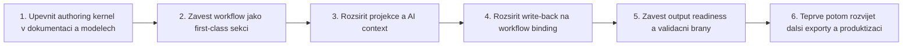

# MetaForge — Tentative Plan dalšího vývoje

Datum: 2026-04-18 (aktualizováno 2026-04-25)
Status: Navazující architektonický směr po dokončení základních vrstev: authoring kernel, workflow, více výstupů a output-aware validace.

---

## Účel

Tento dokument shrnuje, jak smysluplně navázat na dokončený `Projection Pipeline Refactor`, aby další vývoj postupoval po vrstvách, odblokovával následující kroky a neotevíral příliš mnoho architektonických front současně.

Nejde o schválený implementační plán. Je to řazený návrh pořadí, ze kterého lze vybírat další aktivní návrh do `PROPOSALS.md`.

---

## Výchozí stav

- Projection pipeline, základní write-back a ForgeBlock package model vytvořily stabilní architektonické jádro.
- Business-first tok a replay model už dnes umožňují chápat platformu jako authoring kernel, ne jen code generation nástroj.
- Další největší hodnota leží ve workflow vrstvě, output-neutral projekcích a v jednotném modelu připravenosti výstupů.
- AI, discovery a capability metadata už mají základ, ale je potřeba je svázat se synchronizovaným authoring kontextem.

---

## Princip řazení

Pořadí níže je navrženo podle těchto pravidel:

1. Nejdřív posílit interpretaci platformy jako authoring kernelu nad již existujícím základem.
2. Workflow a write-back řešit jako rozšíření source of truth, ne jako bokem stojící feature.
3. Read model, AI context a readiness vrstvy držet output-neutral.
4. Produktizaci a monetizaci rozvíjet až po ustálení authoring a validačních bran.

---

## Doporučené pořadí

### A1. Authoring Kernel Reframing

**Proč teď:**
Bez této změny budou další návrhy stále opticky vypadat jako doplňky codegen platformy. Ve skutečnosti už ale architektura nese zárodek authoring kernelu.

**Scope:**
- držet `Architecture-Define/` v authoring-kernel jazyce,
- ukotvit workflow a multi-output interpretaci,
- udržet guardrails, které se nemění.

**Výsledek:**
Další návrhy budou vznikat nad správným mentálním modelem platformy.

---

### A2. Workflow Model I

**Proč potom:**
Workflow je největší nové rozšíření source of truth. Musí být navrženo dříve, než vzniknou workflow exporty nebo runtime úvahy.

**Scope:**
- workflow sekce v `BusinessAuthoringDocument`,
- základní workflow uzly a commandy,
- vztah workflow k entitám, capability a pending questions.

**Rozhodnuto před startem:**
- OQ-012 — workflow je sekce `BusinessAuthoringDocument` a je sibling k `Entities` a `Relations`

---

### A3. Projection and AI Context II

**Proč potom:**
Jakmile workflow vstoupí do modelu, musí se propsat do read path. Jinak AI i dokumentace zůstanou slepé vůči procesnímu kontextu.

**Scope:**
- workflow projection view,
- authoring context pro AI,
- output-neutral projekce,
- vazba na discovery a capability metadata.

**Detailní návrh:** Viz `PROPOSALS.md` — Plán 16 a `Ideas/Plans/Archiv/plan-16-projection-and-ai-context-II.md`.

---

### A4. Workflow Write-Back I

**Proč až po projekcích:**
Write-back dává smysl teprve tehdy, když je jasné, jak workflow čte read model a jak se binding zobrazí zpět uživateli i AI.

**Scope:**
- workflow binding detail,
- workflow sync metadata computed při replay,
- write-back commandy pro capability binding a enrichment workflow kroků.

---

### A5. Output Readiness and Validation Gates

**Proč až zde:**
Teprve po stabilizaci business, workflow a write-back modelu lze čistě rozhodnout, co znamená `ExportReady` pro různé výstupy.

**Scope:**
- stavy `Draft`, `Enriched`, `ExportReady`,
- readiness per output,
- validační brány pro codegen, workflow export a capability export.

**Nutné uzavřít před startem:**
- OQ-013 — output readiness model

---

### A6. Product Packaging and Monetization Follow-Up

**Proč až nakonec:**
Produktové režimy a rozšířená monetizace mají smysl teprve po ustálení authoring modelu a validačních bran.

**Scope:**
- veřejné MVP: Builder + Analyst nebo jen Builder,
- workflow export jako budoucí premium směr,
- capability a runtime licence až po ověření hodnoty.

**Nutné uzavřít před startem:**
- OQ-015 — veřejné MVP vs. interní připravenost

---

## Doporučený bezprostřední další krok

Nejbližší architektonicky čistá sekvence je:

1. **Workflow Model I** — navrhnout workflow jako first-class sekci authoring dokumentu
2. **Projection and AI Context II** — propsat workflow do read modelu a AI kontextu
3. **Workflow Write-Back I** — binding capability a enrichment workflow kroků
4. **Self-Healing II** — až po stabilizaci authoring a output-ready modelu

---

## Dokumentační follow-up

Před nebo spolu s dalším návrhem stojí za to držet dokumentační disciplínu:

- udržovat `Architecture-Define/` v authoring-kernel interpretaci,
- workflow a output neutrality propsat do dokumentů současně s návrhy,
- nenechat roadmapu sklouznout zpět do čistě codegen-first jazyka.

Tento follow-up není samostatný milestone, ale měl by proběhnout dříve, než se na tyto dokumenty naváže dalším návrhem.