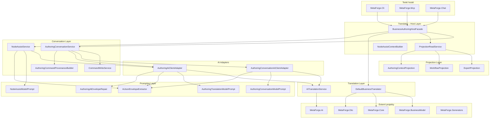
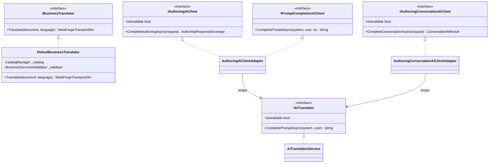
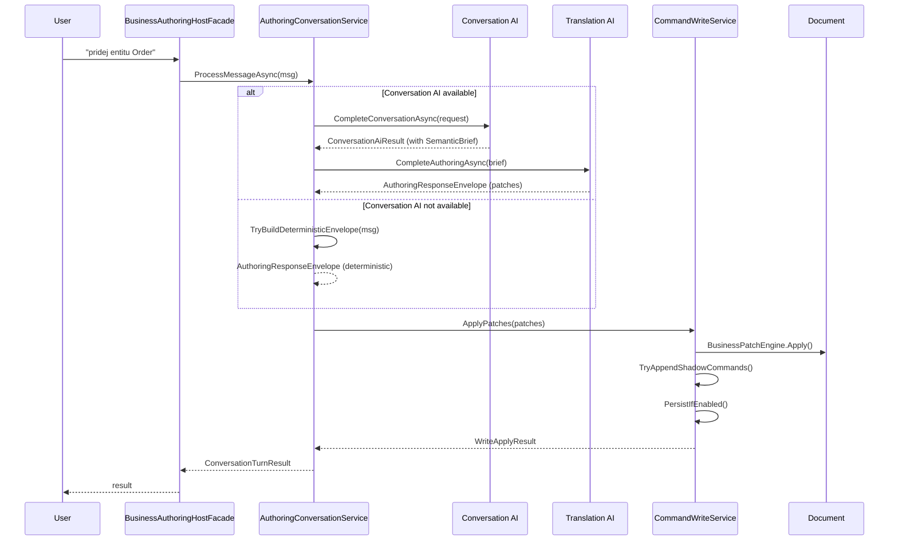

# Architektura MetaForge.Translator

## Přehled

```mermaid
flowchart TB
    subgraph Clients["Tenkí hosté"]
        CLI["MetaForge.Cli"]
        MCP["MetaForge.Mcp"]
        CHAT["MetaForge.Chat"]
    end

    subgraph Facade["Translator – Host Layer"]
        BAHF["BusinessAuthoringHostFacade"]
        PRS["ProjectionReadService"]
        NAB["NodeAssistContextBuilder"]
    end

    subgraph Conversation["Conversation Layer"]
        ACS["AuthoringConversationService"]
        CWS["CommandWriteService"]
        NSA["NodeAssistService"]
        ACPB["AuthoringCommandProvenanceBuilder"]
    end

    subgraph Translation["Translation Layer"]
        DBT["DefaultBusinessTranslator"]
        ATS["AiTranslationService"]
    end

    subgraph Prompting["Prompting Layer"]
        ACON["AuthoringConversationModelPrompt"]
        ATRN["AuthoringTranslationModelPrompt"]
        NAMP["NodeAssistModelPrompt"]
        AJE["AiJsonEnvelopeExtractor"]
        AER["AuthoringAiEnvelopeRepair"]
    end

    subgraph Adapters["AI Adapters"]
        ACA["AuthoringConversationAiClientAdapter"]
        ATA["AuthoringAiClientAdapter"]
    end

    subgraph Projections["Projection Layer"]
        EP["ExpertProjection"]
        WP["WorkflowProjection"]
        ACP["AuthoringContextProjection"]
    end

    subgraph External["Externí projekty"]
        BM["MetaForge.BusinessModel"]
        CORE["MetaForge.Core"]
        AI["MetaForge.Ai"]
        DTO["MetaForge.Dto"]
        GEN["MetaForge.Generators"]
    end

    CLI --> BAHF
    MCP --> BAHF
    CHAT --> BAHF

    BAHF --> ACS
    BAHF --> PRS
    BAHF --> DBT
    BAHF --> NSA

    ACS --> CWS
    ACS --> ACA
    ACS --> ATA
    ACS --> ACPB

    NSA --> ATA

    ACA --> ATS
    ATA --> ATS

    ATS --> AI
    DBT --> BM
    DBT --> CORE
    DBT --> DTO

    PRS --> EP
    PRS --> WP
    PRS --> ACP

    ACA --> ACON
    ACA --> AJE
    ATA --> ATRN
    ATA --> AJE
    ATA --> AER
    NSA --> NAMP
    NSA --> AJE
```

## Klíčové rozhraní

```mermaid
classDiagram
    class IBusinessTranslator {
        <<interface>>
        +Translate(document, language) MetaForgeTransportDto
    }
    class DefaultBusinessTranslator {
        -CatalogManager _catalog
        -BusinessDocumentValidator _validator
        +Translate(document, language) MetaForgeTransportDto
    }
    class IAuthoringAiClient {
        <<interface>>
        +IsAvailable bool
        +CompleteAuthoringAsync(request) AuthoringResponseEnvelope
    }
    class IAuthoringConversationAiClient {
        <<interface>>
        +IsAvailable bool
        +CompleteConversationAsync(request) ConversationAiResult
    }
    class IPromptCompletionAiClient {
        <<interface>>
        +CompletePromptAsync(system, user, ct) string
    }
    class IAiTranslator {
        <<interface>>
        +CompletePromptAsync(system, user) string
        +IsAvailable bool
    }

    IBusinessTranslator <|.. DefaultBusinessTranslator
    IAuthoringAiClient <|.. AuthoringAiClientAdapter
    IAuthoringConversationAiClient <|.. AuthoringConversationAiClientAdapter
    IPromptCompletionAiClient <|.. AuthoringAiClientAdapter
    IAiTranslator <|.. AiTranslationService
    AuthoringAiClientAdapter --> IAiTranslator : wraps
    AuthoringConversationAiClientAdapter --> IAiTranslator : wraps
```

## Two-phase AI pipeline

```mermaid
sequenceDiagram
    participant U as User
    participant F as BusinessAuthoringHostFacade
    participant CS as AuthoringConversationService
    participant CA as Conversation AI
    participant TA as Translation AI
    participant WS as CommandWriteService
    participant D as Document

    U->>F: "pridej entitu Order"
    F->>CS: ProcessMessageAsync(msg)
    
    alt Conversation AI available
        CS->>CA: CompleteConversationAsync(request)
        CA-->>CS: ConversationAiResult (with SemanticBrief)
        CS->>TA: CompleteAuthoringAsync(brief)
        TA-->>CS: AuthoringResponseEnvelope (patches)
    else Conversation AI not available
        CS->>CS: TryBuildDeterministicEnvelope(msg)
        CS-->>CS: AuthoringResponseEnvelope (deterministic)
    end

    CS->>WS: ApplyPatches(patches)
    WS->>D: BusinessPatchEngine.Apply()
    WS->>WS: TryAppendShadowCommands()
    WS->>WS: PersistIfEnabled()
    WS-->>CS: WriteApplyResult
    CS-->>F: ConversationTurnResult
    F-->>U: result
```
