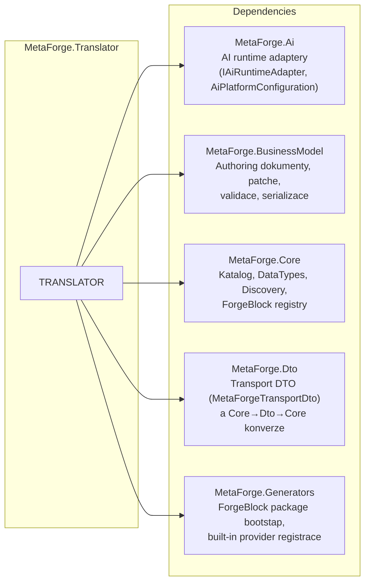
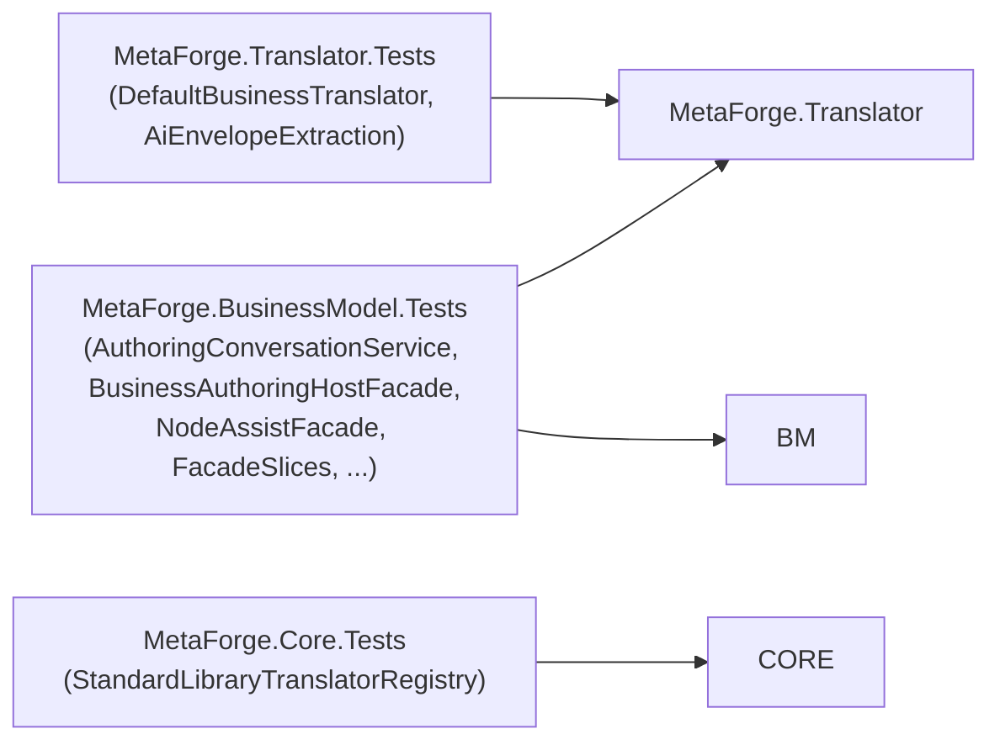
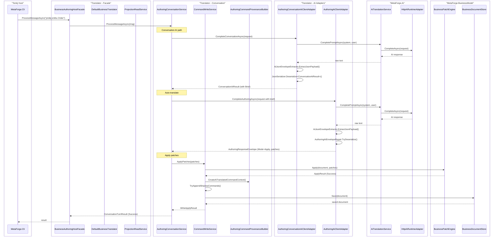

# Závislosti

## Externí projektové reference

### MetaForge.Ai
- `AiPlatformConfiguration` – config pro AI segmenty (Conversation, AuthoringTranslation)
- `IAiRuntimeAdapter` / `HttpAiRuntimeAdapter` – HTTP klient pro AI inference
- `IAiRuntimeAdapterFactory` – továrna na runtime adaptéry

### MetaForge.BusinessModel
- `BusinessAuthoringDocument` – vstupní model pro překlad
- `BusinessEntityNode`, `BusinessAttributeNode`, `BusinessBehaviorNode`, `BusinessRelationNode` – elementy dokumentu
- `BusinessPatchOperation`, `BusinessPatchEngine` – patch aplikace
- `BusinessDocumentStore` – persistence dokumentu
- `BusinessTreeRenderer` – textová reprezentace stromu
- `BusinessDocumentJsonSerializer` – JSON serializace
- `BusinessDocumentValidator` – validace
- `BusinessProjectionView`, `IProjectionQueryService`, `IShadowCommandStore` – projection/shadow log
- `BusinessPatchToCommandMapper` – mapování patchů na command log
- `BusinessAuthoringDocument` factory, `BusinessNoteNode`, `PendingQuestionNode`, `WorkflowBindingSyncState`

### MetaForge.Core
- `CatalogManager` – type resolution, preset lookup, catalog queries
- `ProgramLanguage` – výstupní jazyk (CSharp, Python, ...)
- `DataType` – datové typy (Guid, String, Int, Custom, ...)
- `EntityKind` – Primitive, Class, Enum
- `SemanticCollection` – None, List, Set
- `TypeResolution` / `TypeResolutionExtensions` – výsledek resolve typu
- `IDiscoverySession`, `DiscoveryQuery`, `DiscoveryQueryResult` – discovery API
- `ForgeBlockPackageRegistry` – registr ForgeBlock balíčků
- `IForgeBlockPackage`, `ForgeBlockAttribute` – ForgeBlock metadata
- `BuiltInCatalogProvider`, `ForgeBlockRegistryCatalogProvider` – catalog providery
- `ValueObjectPreset`, `ValidationRulePreset` – preset definice

### MetaForge.Dto
- `MetaForgeTransportDto` – výstupní DTO překladu
- `TransportClassDto`, `TransportPropertyDto`, `TransportMethodDto` – elementy DTO
- `TransportStrongTypeDto`, `TransportTypeModelDto` – typový systém DTO
- `MetaProject`, `Class`, `Property`, `Method` – Core model pro generátory
- `ToCore()` / `ToDto()` – konverze mezi DTO a Core

### MetaForge.Generators
- `BuiltInForgeBlockPackageBootstrap` – registrace built-in ForgeBlock balíčků

## Testovací projekty

## Modely (DTO) napříč vrstvami

| Vstupní model | → | Výstupní model | Kde |
|---------------|---|----------------|-----|
| `BusinessAuthoringDocument` | → | `MetaForgeTransportDto` | `DefaultBusinessTranslator` |
| `ConversationPromptRequest` | → | `ConversationAiResult` | `IAuthoringConversationAiClient` |
| `AuthoringPromptRequest` | → | `AuthoringResponseEnvelope` | `IAuthoringAiClient` |
| `BusinessAuthoringDocument` | → | `ProjectionView` | `ProjectionReadService` |
| `NodeAssistRequest` | → | `NodeAssistProposal` | `BusinessAuthoringHostFacade` |
| User message string | → | `ConversationTurnResult` | `AuthoringConversationService` |
| `BusinessPatchOperation[]` | → | `ConversationTurnResult` | `CommandWriteService` |

## Příklad: Úplný call stack pro "pridej entitu Order" s AI

