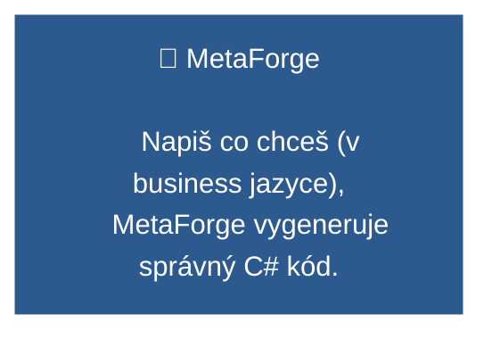
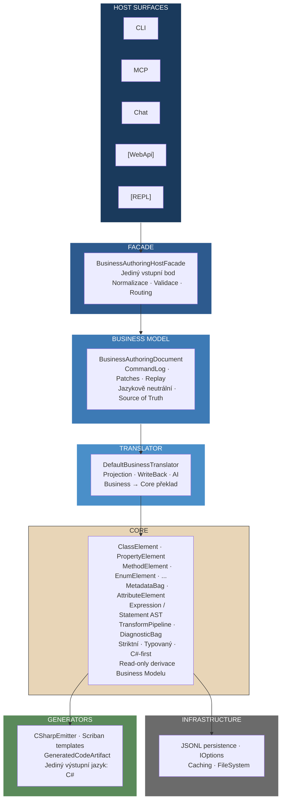
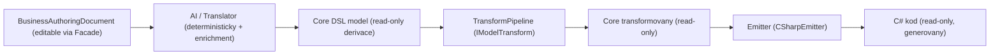
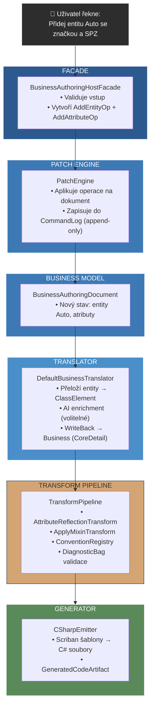
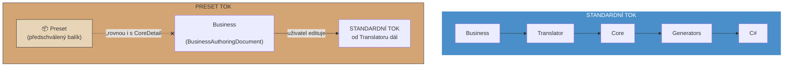
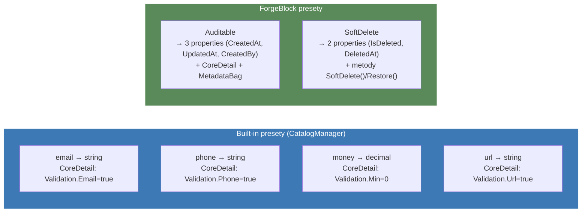
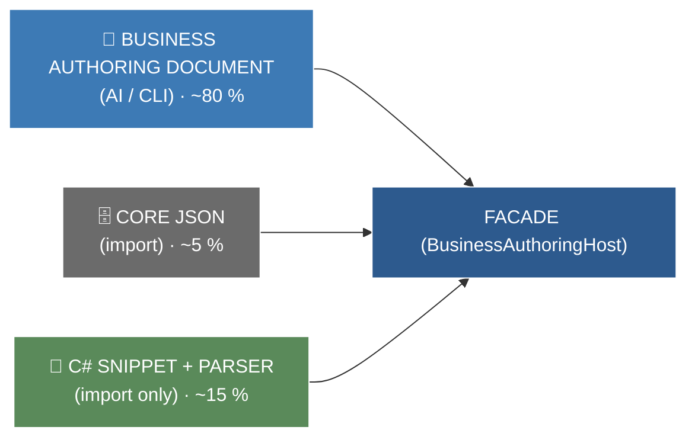

# Architecture Summary — MetaForge Platform

> Jednostránkový konceptuální přehled platformy.
> Co MetaForge je, jaké principy dodržuje a kdo smí editovat kterou vrstvu.

---

## 1. Co MetaForge je

MetaForge je **C# authoring kernel** — platforma pro deklarativní definici C# doménového modelu a deterministické generování kódu.

Klíčová charakteristika:
- **DSL-first**: Popisuje C# sémantické koncepty (class, record, property, enum, interface) — ne syntaxi, ne IL, ne univerzální IR.
- **Deterministický**: Stejný vstup → stejný výstup. Vždy. Verzovatelné, opakovatelné.
- **Metadata-first**: Každý element nese anotace (`MetadataBag`) — validace, dokumentace, generátorové hinty, AI kontext.
- **One-way generation**: Domain → TransformPipeline → Emitters. Žádná editace generovaných souborů.

---

## 2. Vrstvová architektura

---

## 3. Kdo smí editovat kterou vrstvu — editační matice

Toto je **nejdůležitější architektonické pravidlo**. Porušení = architektonická chyba.

| Vrstva | Kdo edituje | Jak | Příklad |
|--------|------------|-----|---------|
| **BusinessAuthoringDocument** | Produkťák, AI, Developer | Přes Facade (MCP/CLI/Chat) | "Přidej entitu Auto s atributem SPZ" |
| | | Všechny změny jdou přes PatchEngine + CommandLog | |
| **Core (DSL model)** | ❌ **Nikdo přímo** | Pouze derivace z Business → Translator | `ClassElement("Auto")` vzniká překladem |
| | Výjimka: CoreDetail sync (int → uint) | Přes `SetCoreDetailOp` → PatchEngine | "Změň typ na uint" |
| | Výjimka: Import existujícího C# kódu | Přes Parser (read-only) → Core → Business projekce | |
| **MetadataBag** | AI, Developer | Přes Fluent Builder API při definici DSL | `.Metadata(m => m.Set("Docs.Summary", "..."))` |
| **AttributeElement** | Developer | Přes Fluent Builder API | `.Attribute("[Required]")` |
| **Generators (šablony)** | Developer | Přímá editace `.scriban` souborů | Uprava `Class.scriban` |
| **TransformPipeline** | Developer | Registrace `IModelTransform` | Přidání `ApplyMixinTransform` |
| **Infrastructure** | Developer | Přímá editace | `JsonCommandLogRepository` |
| **Host Surfaces** | Developer | Přímá editace | Přidání CLI commandu |

### Graficky:

---

## 4. Data flow — cesta změny

## 5. Presety — speciální případ toku dat

Presety (předpřipravené typy, ForgeBlock balíky, šablony entit) mají **výjimku ze standardního toku**:

### Jak presety fungují

1. **Preset je předschválený balík** — obsahuje jak business reprezentaci (název, popis), tak CoreDetail (typová informace, generátorové hinty, MetadataBag).

2. **Load probíhá v jedné operaci** — preset se nahraje rovnou do BusinessAuthoringDocument včetně `BusinessAttributeCoreDetail`. Žádný Translator, žádné AI enrichment.

3. **Standardní tok nastupuje při editaci** — jakmile uživatel začne preset upravovat (přejmenuje property, změní typ, přidá validaci), změny jdou standardní cestou přes Facade → PatchEngine → CommandLog.

### Příklady

### Proč to není porušení principů

| Obava | Vysvětlení |
|-------|------------|
| "CoreDetail se zapisuje bez Translatoru" | Preset je předschválený — CoreDetail je součástí balíku, ne AI odhad. Translator by vyrobil stejný výsledek. |
| "Obchází to CommandLog?" | Ne — load presetu je jedna operace (`AddEntityOp` s preset daty), která se loguje. |
| "Není to přímá editace Core?" | Není. CoreDetail je součást BusinessModelu (`BusinessAttributeCoreDetail`). Core je pořád derivace. |
| "Co když preset nesedí?" | Uživatel edituje standardní cestou → změna se uloží do CommandLogu jako normální patch. |

### Důsledek pro architekturu

Presety nenarušují invariant "Core je read-only derivace", protože:

- **Business má vždy pravdu** — i když CoreDetail přišel s presetem, je to pořád součást BusinessModelu
- **Editace jde standardní cestou** — jakákoliv změna presetových dat prochází PatchEngine
- **Translator není obcházen trvale** — jen při prvotním loadu. Další změny už jdou přes Translator

---

## 6. Nejdůležitější principy

| # | Princip | Význam |
|---|---------|--------|
| 1 | **BusinessAuthoringDocument je jediný source of truth** | Veškerý stav je odvoditelný z dokumentu + CommandLogu |
| 2 | **Core je read-only derivace** | Nikdo needituje Core přímo. Všechny změny tečou přes Business |
| 3 | **One-way generation** | Domain → Core → C#. Žádná editace generovaných souborů |
| 4 | **Změny jdou přes CommandLog** | Append-only. Historie se nikdy nemaže ani nepřepisuje |
| 5 | **Facade je jediný vstupní bod** | CLI, MCP, Chat — vše jde přes stejnou Facade |
| 6 | **AI je volitelná** | Systém funguje bez AI. AI je overlay, ne dependency |
| 7 | **Deterministický výstup** | Stejný vstup → stejný výstup. Vždy |
| 8 | **Metadata jsou univerzální** | `Validation.Min=0` je smysluplné pro C#, SQL, OpenAPI |
| 9 | **TransformPipeline je immutable** | Každý transform je čistá funkce bez side effects |
| 10 | **Fail-fast validace** | DiagnosticBag zachytí chyby před generováním |

---

## 7. Dva anotační systémy

| Systém | Účel | Příklad |
|--------|------|---------|
| **AttributeElement** | C#-specific `[Atributy]` | `[Required]`, `[JsonIgnore]`, `[MyCustom("arg")]` |
| **MetadataBag** | Univerzální anotace | `Docs.Summary`, `Validation.MinLength`, `Generation.Ignore` |

Pravidlo: *"Je to `[Attribute]` v C# syntaxi? → AttributeElement. Je to anotace/hint/doc? → MetadataBag."*

Oba systémy jsou komplementární a generátor čte oba — primárně z MetadataBag, s fallbackem na AttributeElement reflexi.

---

## 8. Vstupní kanály — tři cesty do systému

| Cesta | Podíl | Charakter |
|-------|-------|-----------|
| **BusinessAuthoringDocument** | ~80 % | Nové entity, business logika, pravidla — AI nebo CLI přes Facade |
| **C# Snippet + Parser** | ~15 % | Import existujícího C# kódu. Parser → Core → Business (zpětná projekce). Read-only import |
| **Core JSON** | ~5 % | Bulk operace, migrace, tooling. Přímý import do Core |

---

## 9. Klíčové soubory a jejich účel

| Soubor | Účel |
|--------|-------|
| `PROPOSALS.md` | Master checklist — co se implementuje |
| `PROPOSALS_NEXT.md` | Zásobník kandidátních návrhů |
| `Docs/Plans/PROP-*.md` | Detailní specifikace jednotlivých návrhů |
| `Progress.md` | Chronologický log dokončených změn |
| `New_Architecture/*.md` | Kompletní architektonická dokumentace |
| `Memories.md` | Provozní knowledge, lessons learned |

---

## 10. Co se nesmí stát (anti-patterns)

- ❌ Přímá mutace BusinessAuthoringDocument bez CommandLog záznamu.
- ❌ Host surface obsahující business logiku.
- ❌ Core závisející na Translator nebo Business Model.
- ❌ AI bez fallbacku.
- ❌ Manuální editace vygenerovaného C# kódu (Source Hash Guardrail).
- ❌ Implementace bez schváleného návrhu v PROPOSALS.md.
- ❌ Dva systémy pro stejnou věc (např. XmlDocElement vedle MetadataBag.Docs.*).

---

> **Verze:** 2026-07-08  
> **Navazuje na:** New_Architecture/01-Architectural-Guardrails.md, Perplexity konverzace e0609fe1  
> **Pokrývá rozhodnutí z:** PROP-038, PROP-039
